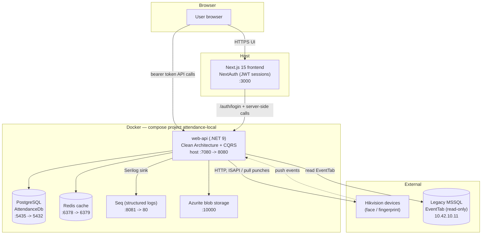

# System Overview

The Attendance platform is composed of a **Next.js frontend**, a **.NET 9 Web API**, supporting
infrastructure services (**PostgreSQL**, **Redis**, **Seq**, **Azurite**), and external integrations
to **Hikvision** attendance devices and a **legacy MSSQL** event store. In local development the
backend and all infrastructure run in Docker (compose project `attendance-local`); the frontend runs
on the host with `npm run dev` so a single `localhost:7080` base URL is correct for both the Node
server (NextAuth) and the browser.

## Components & topology



The frontend issues most authenticated data calls **directly from the browser** to the API using the
bearer token stored in the NextAuth session. NextAuth's server-side `authorize()` also calls the API
(`/auth/login`) to validate credentials and obtain the token. Both paths resolve to the same
`NEXT_PUBLIC_API_URL` (`http://localhost:7080`) in local dev.

## End-to-end flow: login then an authenticated data call

```mermaid
sequenceDiagram
    participant B as Browser
    participant FE as Next.js / NextAuth (host :3000)
    participant API as .NET Web API (:7080)
    participant PG as PostgreSQL
    participant R as Redis

    Note over B,API: 1) Login
    B->>FE: POST /api/auth/callback/credentials (userLogin, password)
    FE->>API: POST /auth/login (authorize -> fetchAuth)
    API->>PG: look up User by user_login
    PG-->>API: user row (PBKDF2 hash)
    API->>API: verify password (PasswordHasher)
    API-->>FE: { isSuccess, data: { token (JWT), userId } }
    FE->>FE: store token in NextAuth JWT session (8h)
    FE-->>B: Set-Cookie session; redirect to app

    Note over B,API: 2) Authenticated data call
    B->>API: GET /dashboard/stats?OrganizationId=... (Authorization: Bearer <token>)
    API->>API: JwtBearer validates token + permission policy
    API->>R: check cache (CacheService)
    alt cache hit
        R-->>API: cached payload
    else cache miss
        API->>PG: query via IQueryHandler
        PG-->>API: rows
        API->>R: store payload
    end
    API-->>B: 200 JSON (Result mapped to HTTP)
```

## Components

| Component | Where | Host port | Role |
|---|---|---|---|
| **Next.js 15 frontend** | Host (`npm run dev`) | **3000** | App Router UI; NextAuth credential auth with JWT sessions; calls the API from both server and browser. |
| **web-api (.NET 9)** | Docker | **7080** (→ 8080) | The application: Clean Architecture + CQRS, JWT auth, permission-based authorization, Hangfire jobs, Swagger/Hangfire dashboards in dev. Port 7080 chosen because macOS AirPlay owns 7000. |
| **PostgreSQL** | Docker | **5435** (→ 5432) | Primary store (`AttendanceDb`): ~21 `public` + 12 `hangfire` tables. EF Core migrations applied on startup in dev. |
| **Redis** | Docker | **6378** (→ 6379) | Distributed cache via `StackExchangeRedisCache` / `ICacheService`. |
| **Seq** | Docker | **8081** (→ 80) | Structured-log viewer; Serilog writes request logs and command/query errors here. |
| **Azurite (blob storage)** | Docker | **10000** | Local Azure Blob emulator behind `IBlobService` for file attachments. |
| **Hikvision devices** | External network | — | Biometric/face devices that produce punch events consumed and validated into attendance logs. |
| **Legacy MSSQL** | External (`10.42.10.11`) | — | Read-only `EventTab` event source accessed via `ExternalAttendanceDbContext`; unreachable locally (only the sync feature needs it). |

### Health & dashboards (dev)

- API health: `http://localhost:7080/health`
- Swagger: `http://localhost:7080/swagger`
- Hangfire: `http://localhost:7080/hangfire`
- Seq logs: `http://localhost:8081`

See [01-architecture-patterns.md](01-architecture-patterns.md) for how a request flows through the
API internally.
