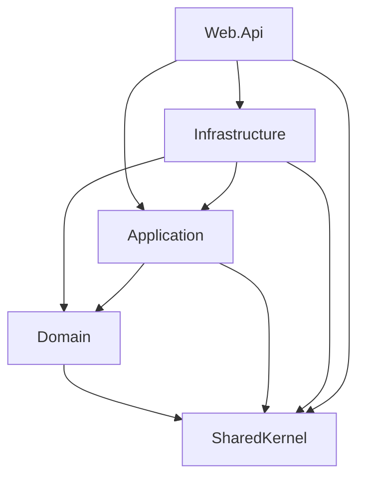
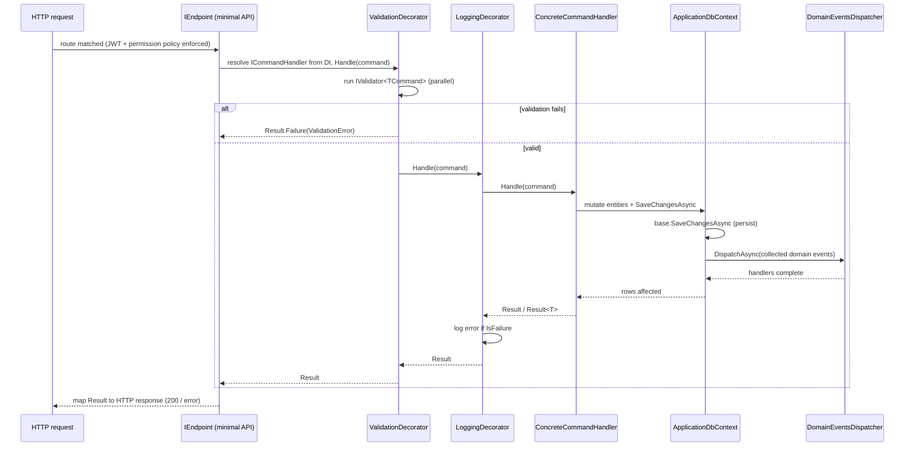

# Architecture & Patterns (Backend)

The Web API (`original/AttendanceAppV2/src`) follows **Clean Architecture** with a **CQRS** message
flow. Cross-cutting concerns (validation, logging) are layered as **decorators** around handlers, the
**Result** type carries success/failure without exceptions, **domain events** are dispatched after
`SaveChanges`, and HTTP endpoints **self-register** via the `IEndpoint` interface. Wiring lives in
three composition roots: `Web.Api/Program.cs`, `Application/DependencyInjection.cs`, and
`Infrastructure/DependencyInjection.cs`.

## Layers

| Project | Responsibility | Knows about |
|---|---|---|
| **SharedKernel** | Primitives shared by all layers: `Result`/`Result<T>`, `Error`, `Entity` base (holds domain events), `IDomainEvent`. | nothing |
| **Domain** | Entities (`Attendance`, `AttendanceLog`, `Employee`, `Device`, `Leave`, `Shift`, `OrganizationalUnit`, …), domain events, entity-specific error definitions, enums. Pure business model, no infrastructure. | SharedKernel |
| **Application** | Use cases as CQRS messages (`ICommand`/`IQuery`) and their handlers, FluentValidation validators, domain-event handlers, abstractions (`IApplicationDbContext`, `ICacheService`, `IUserContext`, `IBlobService`, `ITokenProvider`, `IDomainEventsDispatcher`). Defines interfaces; depends on no concrete infrastructure. | Domain, SharedKernel |
| **Infrastructure** | Implementations: EF Core `ApplicationDbContext` (Npgsql, snake_case), `ExternalAttendanceDbContext` (MSSQL, read-only), Redis `CacheService`, JWT `TokenProvider`/`UserContext`, permission authorization, `DomainEventsDispatcher`, Hangfire jobs, Hikvision client, blob storage. | Application, Domain, SharedKernel |
| **Web.Api** | HTTP host: minimal-API endpoints (`IEndpoint`), middleware, Serilog, CORS, rate limiting, Swagger/Hangfire dashboards, health checks. Composition root that calls `AddApplication() + AddPresentation() + AddInfrastructure()`. | Application, Infrastructure, SharedKernel |

### Layer dependencies



The Dependency Rule holds: dependencies point inward toward Domain/SharedKernel. Application defines
interfaces (e.g. `IApplicationDbContext`); Infrastructure supplies the implementations, and Web.Api
composes them at startup. `Web.Api` references `Infrastructure` only to register it in the DI
container, not to call infrastructure types directly.

## CQRS messaging

Use cases are modeled as messages and handlers (`Application/Abstractions/Messaging`):

- `ICommand`, `ICommand<TResponse>` — write operations.
- `IQuery<TResponse>` — read operations.
- `ICommandHandler<TCommand>` / `ICommandHandler<TCommand, TResponse>` and
  `IQueryHandler<TQuery, TResponse>` — handlers, each returning a `Result` / `Result<T>`.

Handlers are discovered and registered by assembly scanning (Scrutor) in
`Application/DependencyInjection.cs` with scoped lifetime. Domain-event handlers
(`IDomainEventHandler<>`) and FluentValidation validators are registered the same way. There is no
MediatR; endpoints resolve the concrete handler interface from DI and call `Handle(...)` directly.

## The Result pattern

`SharedKernel/Result.cs` models outcomes without throwing for expected failures:

- `Result` carries `IsSuccess` / `IsFailure` and an `Error`. The constructor enforces the invariant
  that a success has `Error.None` and a failure has a non-`None` error.
- `Result<TValue>` adds a `Value` that throws if accessed on a failure, an implicit conversion from
  `TValue` (null → `Error.NullValue`), and `ValidationFailure` for validation errors.
- Handlers return `Result`/`Result<T>`; endpoints translate that into HTTP (success payload vs. an
  error response derived from `Error`). Validation failures from the decorator are surfaced as a
  `ValidationError` aggregating each field error.

## Decorator behaviors

Cross-cutting behavior is added by **decorating** handler registrations (Scrutor `Decorate`) in
`Application/DependencyInjection.cs`, so the pipeline is plain DI rather than a mediator.

- **ValidationDecorator** (`Behaviors/ValidationDecorator.cs`) wraps command handlers. It runs all
  registered `IValidator<TCommand>` in parallel; if any fail it short-circuits with
  `Result.Failure(ValidationError)` and never calls the inner handler. Applied to `ICommandHandler<>`
  and `ICommandHandler<,>` (commands only — queries are not validated).
- **LoggingDecorator** (`Behaviors/LoggingDecorator.cs`) wraps both commands and queries. It invokes
  the inner handler and, on failure, logs the error with Serilog `LogContext` enrichment (the
  success-path logs are present but commented out).

Registration order means the **validation** decorator runs first (outermost for commands), then
**logging**, then the actual handler:

```
ICommandHandler  ->  ValidationDecorator  ->  LoggingDecorator  ->  ConcreteHandler
IQueryHandler    ->  LoggingDecorator     ->  ConcreteHandler
```

## Domain events

Entities accumulate `IDomainEvent`s (via the `Entity` base in SharedKernel). Dispatch happens inside
`ApplicationDbContext.SaveChangesAsync` (`Infrastructure/Database/ApplicationDbContext.cs`):
`base.SaveChangesAsync` runs first, then `PublishDomainEventsAsync` collects events from tracked
entities, clears them, and hands them to `IDomainEventsDispatcher`. This is **after** persistence —
eventual consistency, handlers run in a separate logical step.

`DomainEventsDispatcher` (`Infrastructure/DomainEvents/DomainEventsDispatcher.cs`) resolves
`IDomainEventHandler<>` for each event type (caching the closed generic and a wrapper type for
reflection-free dispatch), creating a fresh DI scope per event, and invokes every registered handler.

## Endpoint auto-registration

Each endpoint implements `IEndpoint` (`Web.Api/Endpoints/IEndpoint.cs`) with a `MapEndpoint`
method. In `Web.Api/Extensions/EndpointExtensions.cs`:

- `AddEndpoints(assembly)` scans the executing assembly for non-abstract `IEndpoint` types and
  registers them all as transient `IEndpoint` services.
- `MapEndpoints()` resolves every `IEndpoint` and calls `MapEndpoint(builder)` to wire its routes.
- `HasPermission(permission)` is an extension on `RouteHandlerBuilder` that maps to
  `RequireAuthorization(permission)`, driving permission-based authorization (custom policy provider
  in `Infrastructure/Authorization`).

This keeps `Program.cs` free of explicit `app.MapGet/MapPost` calls — adding an endpoint is just
adding a class. `Program.cs` calls `AddEndpoints(Assembly.GetExecutingAssembly())` then
`app.MapEndpoints()`.

## Request pipeline (end to end inside the API)



For the cross-process view (browser → NextAuth → API → Postgres/Redis) see
[00-system-overview.md](00-system-overview.md).
