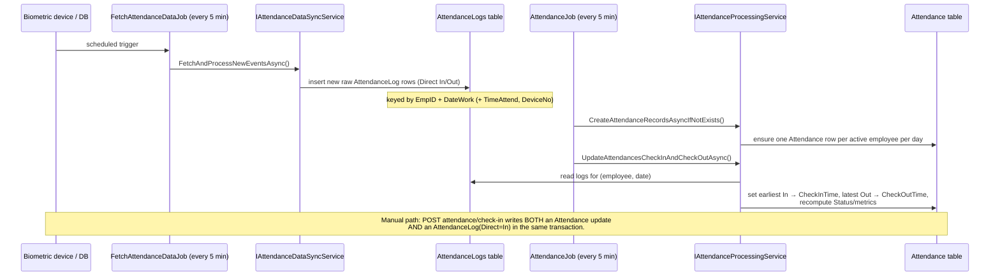

# Attendance Logs Module

## 1. Purpose

An **Attendance Log** is a raw event record — a single card swipe / biometric punch / manual entry
captured from a device. Logs are the immutable input stream; they are distinct from the daily
[`Attendance`](./attendance.md) summary row that the system derives from them. Logs are produced two
ways: (a) ingested from external devices by the recurring `FetchAttendanceDataJob`, and (b) written
inline whenever a check-in/check-out happens (the `CheckInCommandHandler` appends an `AttendanceLog`
with `Direct = In`). They are also CRUD-manageable through the API for manual correction.

## 2. Key entities / types

**`AttendanceLog`** (`Domain/Entities/Attendance/AttendanceLog.cs`), inherits `AuditableEntity<Guid>`:
- `DateTimeAttend` — event timestamp (stored UTC).
- `CardNo` — badge/card number.
- `EmpID` — employee identifier as a string (the check-in handler stores the employee `Guid` here as text).
- `DateWork` (`DateOnly`) — the work date the event belongs to.
- `TimeAttend` (`TimeSpan?`) — time-of-day portion.
- `Direct` (`int`) — direction: `1 = In`, `2 = Out` (`DirectType` enum: `In`, `Out`).
- `DeviceName`, `DeviceNo` — source device identity.

**Domain events**: `AttendanceLogCreatedDomainEvent(LogId, EmployeeId, Time)`,
`AttendanceLogVerifiedDomainEvent(LogId, EmployeeId, VerifiedBy)`,
`AttendanceLogRejectedDomainEvent(LogId, EmployeeId)`.

> There is **no foreign key** from `AttendanceLog` to `Attendance`. The log is a flat audit row
> keyed by `EmpID` + `DateWork`; correlation to an attendance record is logical (matching employee +
> date), performed by the processing service / SQL functions, not by a navigation property.

## 3. Endpoints

Base tag: `AttendanceLogs`. JWT role-claim policy + `per-user` rate limiting on every endpoint.

| Method | Route | Handler (Command/Query) | Roles allowed |
|---|---|---|---|
| POST | `attendance-logs` | `CreateAttendanceLogCommand` | Admin, Employee, Manager, SuperAdmin |
| PUT | `attendance-logs/{id}` | `UpdateAttendanceLogCommand` → `AttendanceLogResponse` | Admin, SuperAdmin |
| DELETE | `attendance-logs/{id}` | `DeleteAttendanceLogCommand` (204) | SuperAdmin |
| GET | `attendance-logs` | `GetAttendanceLogsQuery` → `PaginatedResponse<AttendanceLogResponse>` | Admin, Employee, Manager, SuperAdmin |
| GET | `attendance-logs/{id}` | `GetAttendanceLogByIdQuery` → `AttendanceLogResponse` | Admin, Employee, Manager, SuperAdmin |

List query filters: `OrganizationId`, `StartDate`, `EndDate`, `Direct`, `DeviceName`, `DeviceNo`,
`EmpID`, `EmpName`, `SearchTerm`, `SortBy`, `SortOrder`, plus paging.

## 4. Flows

### Log → Attendance correlation

Correlation is by **employee + work date**: the processing service groups logs for a day, takes the
earliest `In` and latest `Out`, and folds them into the matching `Attendance` row (creating the row
first if the daily job has not). No referential link is stored on the log itself.

## 5. Cross-cutting touchpoints

- **Background jobs** — `FetchAttendanceDataJob` ingests logs; `AttendanceJob` consumes them to update
  attendance. Both recurring every 5 min. See [cross-cutting.md](./cross-cutting.md#hangfire-background-jobs).
- **Auth & authorization** — JWT role-claim policy; write/delete are restricted to Admin/SuperAdmin.
  See [cross-cutting.md](./cross-cutting.md#jwt-authentication).
- **Time** — timestamps normalized to UTC via `IDateTimeProvider`. See
  [cross-cutting.md](./cross-cutting.md#time--timezone).
- **External DB sync** — fetch path reads a remote source through `IAttendanceDataSyncService`
  (the `sqlServer` connection noted in the project CLAUDE.md).

## 6. Source map

- Domain entity: `original/AttendanceAppV2/src/Domain/Entities/Attendance/AttendanceLog.cs`
  (+ `AttendanceLogErrors.cs`, `AttendanceLog*DomainEvent.cs`).
- Application handlers: `original/AttendanceAppV2/src/Application/Features/Attendance/AttendanceLogs/`
  (`Create/`, `Update/`, `Delete/`, `Get/`, `GetById/`).
- Web.Api endpoints: `original/AttendanceAppV2/src/Web.Api/Endpoints/AttendanceLogs/`.
- Ingestion/processing: `Infrastructure/BackgroundJobs/FetchAttendanceDataJob.cs`,
  `AttendanceJob.cs`; `Infrastructure/Services/` (`IAttendanceDataSyncService`,
  `IAttendanceProcessingService`).
