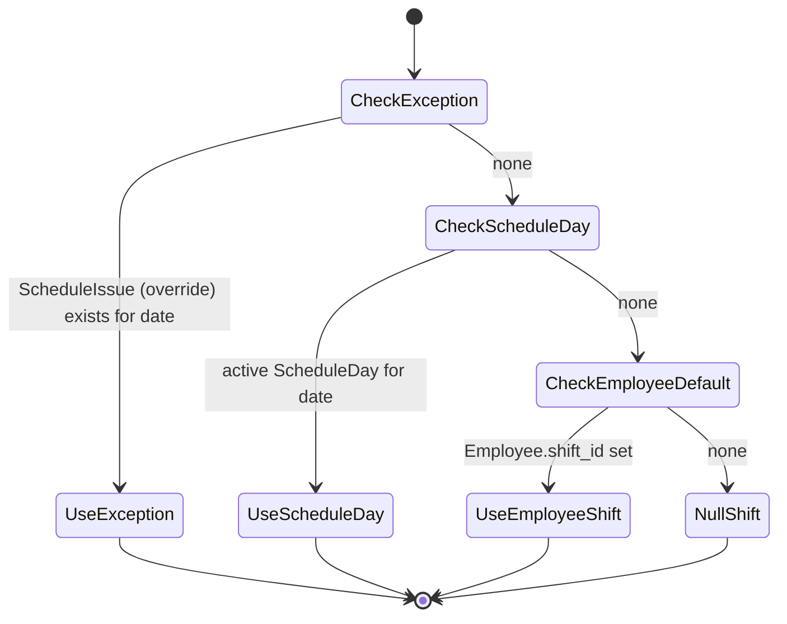

# Attendance Schedules Module

## 1. Purpose

An **Attendance Schedule** binds an employee to a date range and a set of **per-day shift
assignments** (`ScheduleDay`). It answers the question the daily attendance job and the check-in flow
both ask: *"which shift does this employee work on this date?"* Schedules drive the shift-resolution
priority used by the SQL functions and by `CheckInCommandHandler`, and they let admins exclude
non-working days (e.g. Fridays/Saturdays). A **bulk-insert** path creates schedules for every eligible
employee at once, both in C# and via a Postgres function.

## 2. Key entities / types

**`AttendanceSchedule`** (`Domain/Entities/Attendance/AttendanceSchedule.cs`, `AuditableEntity<Guid>`):
- `EmployeeId` (FK), `StartDate` (`DateOnly`), `EndDate?` (`DateOnly?`, null = open-ended).
- `ScheduleType` (`ScheduleType`), `IsActive`, `Notes?`.
- `ExcludedDates` (`List<DateOnly>`) — days to skip (stored as a comma-separated string).
- Navigations: `Employee`, `ScheduleDays` (one-to-many), `Exceptions` (`ScheduleIssue` overrides),
  `Attendances`.

**`ScheduleDay`** (`Domain/Entities/Attendance/ScheduleDay.cs`, `AuditableEntity<Guid>`):
- `AttendanceScheduleId` (FK), `ScheduleDayDate` (`DateOnly`), `ShiftId` (FK), `IsActive`, `Notes?`.
- Navigations: `AttendanceSchedule`, `Shift`.
- A **unique index on `(AttendanceScheduleId, DayOfWeek/Date)`** guards against duplicate day rows —
  this index is what surfaced the bug described below.

**Enums**: `ScheduleType` = `Regular(1)`, `Rotating(2)`, `Flexible(3)`, `Custom(4)`;
`DayOfWeek` = `Sunday … Saturday` (`Domain.Enums.DayOfWeek`).

## 3. Endpoints

Base tag: `AttendanceSchedules`. JWT role-claim policy + `per-user` rate limiting on every endpoint.

| Method | Route | Handler (Command/Query) | Roles allowed |
|---|---|---|---|
| POST | `attendance-schedules` | `CreateAttendanceScheduleCommand` → `bool` | Admin, SuperAdmin |
| POST | `attendance-schedules/bulk` | `BulkInsertAttendanceScheduleCommand` → `bool` | Admin, SuperAdmin |
| PUT | `attendance-schedules/{id:guid}` | `UpdateAttendanceScheduleCommand` → `AttendanceScheduleResponse` | Admin, SuperAdmin, Employee |
| PUT | `attendance-schedules/{attendanceScheduleId}/schedule-days` | `UpdateScheduleDaysCommand` | Admin, SuperAdmin, Employee |
| DELETE | `attendance-schedules/{id:guid}` | `DeleteAttendanceScheduleCommand` (204) | SuperAdmin |
| GET | `attendance-schedules` | `GetAttendanceSchedulesQuery` → `PaginatedResponse<AttendanceScheduleResponse>` | Admin, Employee, Manager, SuperAdmin |
| GET | `attendance-schedules/{id:guid}` | `GetAttendanceScheduleByIdQuery` → `ApiResponse<AttendanceScheduleResponse>` | Admin, Employee, Manager, SuperAdmin |
| GET | `attendance-schedules/my-schedules` | `GetMySchedulesQuery` → `PaginatedResponse<AttendanceScheduleResponse>` | Admin, Employee, Manager, SuperAdmin, User |

`bulk` body: `StartDate`, `EndDate?`, `ShiftId`. It creates a `Regular` schedule for every employee
without an overlapping active schedule, generating a `ScheduleDay` per date in range and excluding
Fridays/Saturdays.

## 4. Flows

### Schedule creation (sequence)

```mermaid
sequenceDiagram
    actor Admin
    participant API as Create / BulkInsert endpoint
    participant H as Create/BulkInsert handler
    participant DB as ApplicationDbContext

    Admin->>API: POST attendance-schedules (or /bulk)
    API->>H: command

    alt single Create
        H->>DB: validate employee + non-overlapping active schedule
        H->>H: scheduleId = Guid.NewGuid()
        loop each day in range
            H->>H: new ScheduleDay { Id=Guid.NewGuid(), AttendanceScheduleId=scheduleId, ShiftId }
        end
        H->>DB: add AttendanceSchedule (+ ScheduleDays) ; SaveChanges
    else BulkInsert (C# handler)
        H->>DB: load all active employee ids (NoTracking)
        H->>DB: find employees with overlapping active schedules → skip set
        loop each target employee (batches of 500)
            H->>H: scheduleId = Guid.NewGuid()
            H->>H: excluded = Fridays + Saturdays in range
            loop each date in [StartDate, EndDate]
                H->>H: new ScheduleDay { Id=Guid.NewGuid(), AttendanceScheduleId=scheduleId, ShiftId }
            end
        end
        H->>DB: AutoDetectChanges off → AddRange → SaveChanges → detach → repeat
    end
    H-->>Admin: Result.Ok(true)
```

### Shift resolution for a given day



This priority (Exception → ScheduleDay → Employee default → null) is implemented in
`GetEmployeesShiftForToday.sql` / `GetEmployeesWithShiftForToday.sql` and mirrored by the check-in
handler.

## 5. SQL functions

Located in `Infrastructure/Database/Functions/`:

- **`bulk_insert_attendance_schedules(p_start_date, p_end_date, p_shift_id)`** — DB-side equivalent of
  the bulk command. Validates the shift, finds employees lacking an overlapping active schedule,
  inserts one `AttendanceSchedule` (`Regular`, active) and a `ScheduleDay` per date (using
  `gen_random_uuid()`), recording Fri/Sat in `ExcludedDates`. Returns counts
  (schedules/days/employees processed/skipped, execution ms).
- **`create_daily_attendance_records()`** — for each active employee without a row for today, inserts
  an `Attendance` (`Status = Pending`), resolving `shift_id` via COALESCE(today's ScheduleDay shift,
  employee default) and linking the matching active `attendance_schedule_id` (skipping excluded dates).
  Returns created/skipped counts + execution ms.
- **`get_employees_shift_for_today()`** — returns `(employee_id, organization_id, shift_id)` applying
  the Exception → ScheduleDay → Employee-default priority.
- **`get_employees_with_shift_for_today()`** — diagnostic superset that also returns `shift_name`,
  `shift_source`, and `has_schedule` / `has_schedule_day` / `has_exception` flags.

## 6. Known issue (fixed) — missing Guid generation for ScheduleDays

Source: `original/AttendanceAppV2/ROOT_CAUSE_ANALYSIS.md`.

**Symptom**: bulk-created schedules saved only 2–4 *random* `ScheduleDay` rows instead of the full set.

**Root cause**: schedules and days were created without explicitly setting `Id`. In
`AuditableEntity<T>` the default is `Id = default!`, so for `T = Guid` the id was `Guid.Empty`. Every
`ScheduleDay` therefore got `AttendanceScheduleId = Guid.Empty` (the parent's empty id) **and** an
empty own `Id`. The unique index on `(AttendanceScheduleId, DayOfWeek)` then rejected all but the
first day as a duplicate key on `Guid.Empty`; some slipped through via races, leaving partial,
random-looking day sets.

**Fix** (verified present in
`Application/Features/Attendance/AttendanceSchedules/BulkInsert/BulkInsertAttendanceScheduleHandler.cs`):
generate the id explicitly **before** creating children —
`var scheduleId = Guid.NewGuid();` on the schedule, and
`Id = Guid.NewGuid(), AttendanceScheduleId = scheduleId` on each `ScheduleDay`. The DB function uses
`gen_random_uuid()` for the same reason. **Lesson**: always assign `Guid` ids explicitly for new
entities — don't rely on EF/DB defaults when child FKs reference the parent's id in memory.

## 7. Cross-cutting touchpoints

- **Background jobs** — `AttendanceJob` calls `create_daily_attendance_records()`, which consumes
  schedules. See [cross-cutting.md](./cross-cutting.md#hangfire-background-jobs).
- **Auth** — JWT role-claim policy; mutations restricted to Admin/SuperAdmin (Employee may update).
  See [cross-cutting.md](./cross-cutting.md#jwt-authentication).
- **Time** — Asia/Baghdad "today" resolution. See [cross-cutting.md](./cross-cutting.md#time--timezone).

## 8. Source map

- Domain entities: `original/AttendanceAppV2/src/Domain/Entities/Attendance/AttendanceSchedule.cs`,
  `ScheduleDay.cs`, `ScheduleIssue.cs` (+ matching `*Errors.cs`).
- Application handlers:
  `original/AttendanceAppV2/src/Application/Features/Attendance/AttendanceSchedules/`
  (`Create/`, `BulkInsert/`, `Update/`, `UpdateScheduleDays/`, `Delete/`, `Get/`, `GetById/`,
  `GetMySchedules/`, `shared/`).
- Web.Api endpoints: `original/AttendanceAppV2/src/Web.Api/Endpoints/AttendanceSchedules/`.
- SQL functions: `original/AttendanceAppV2/src/Infrastructure/Database/Functions/*.sql`.
- Root-cause writeup: `original/AttendanceAppV2/ROOT_CAUSE_ANALYSIS.md`.
