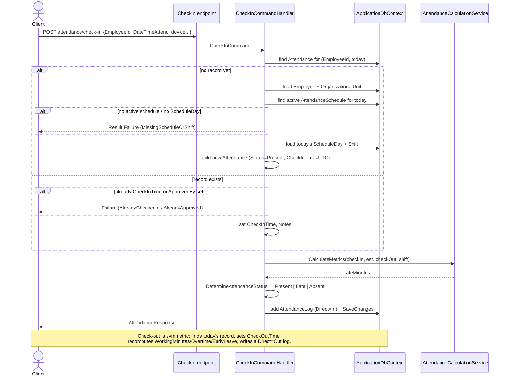
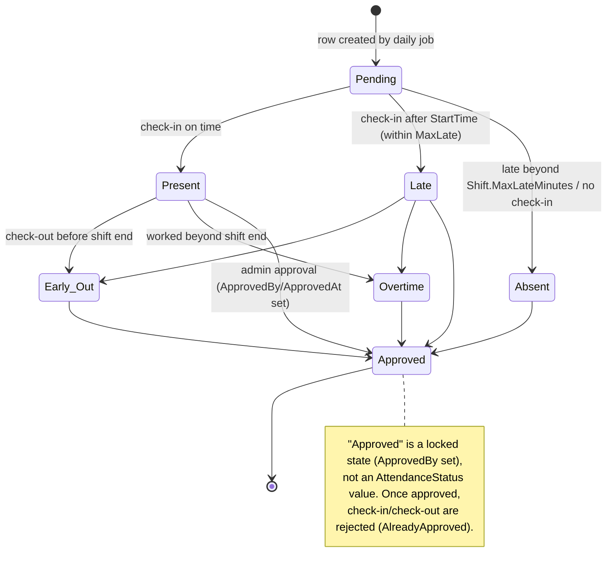

# Attendance Module

## 1. Purpose

The Attendance module owns the **daily attendance record** for each employee — the single row that
captures check-in/check-out times, computed metrics (late/overtime/early-leave minutes), status
(Present, Late, Absent, …), and the approval state. It also owns **attendance breaks** — intervals
(compensatory time, holiday, vacation) attached to a day's attendance.

It sits at the center of the system: attendance rows are created either by the recurring Hangfire job
(via the `create_daily_attendance_records()` SQL function) or on-demand during check-in, are fed by
[Attendance Logs](./attendance-logs.md) (raw device swipes), are shaped by
[Attendance Schedules](./attendance-schedules.md) (which shift applies to a given day), and are read by
the dashboard and reports.

## 2. Key entities / types

**`Attendance`** (`Domain/Entities/Attendance/Attendance.cs`)
- Identity & ownership: `EmployeeId`, `OrganizationId`, `Date` (UTC, date-only midnight).
- Times: `CheckInTime?`, `CheckOutTime?`, `CheckInMethod?` / `CheckOutMethod?` (`LogMethod` enum).
- Computed metrics: `WorkingMinutes?`, `BreakMinutes?`, `OvertimeMinutes?`, `LateMinutes?`,
  `EarlyLeaveMinutes?`.
- Status: `Status` (`AttendanceStatus`).
- Linkage: `ShiftId?`, `AttendanceScheduleId?`.
- Approval: `ApprovedBy?` (user id), `ApprovedAt?`.
- Navigations: `Employee` (required), `Shift?`, `AttendanceSchedule?`, `Breaks` (one-to-many).

**`AttendanceBreak`** (`Domain/Entities/Attendance/AttendanceBreak.cs`)
- `AttendanceId` (FK), `StartTime`, `EndTime?`, `DurationMinutes`, `BreakType`, `Notes?`.
- Navigation: `Attendance` (required, parent).

**Enums** (`Domain/Enums`)
- `AttendanceStatus`: `Present(1)`, `Absent(2)`, `Break(3)`, `Vacation(4)`, `Holiday(5)`, `Late(6)`,
  `Early_Out(7)`, `Overtime(8)`, `Duty(9)`, `Exempted(10)`, `Permitted(11)`, `Pending(12)`.
- `BreakType`: `Compensatory(1)`, `Holiday(2)`, `Vacation(3)`.
- `LogMethod`: `Mobile_App(1)`, `Web(2)`, `Biometric(3)`, `RFID_Card(4)`, `NFC_Card(5)`, `QR_Card(6)`,
  `Manual_Entry(7)`, `API(8)`.

**Domain events** (declared under `Domain/Entities/Attendance/`): `AttendanceCreatedDomainEvent`,
`AttendanceCheckedInDomainEvent`, `AttendanceCheckedOutDomainEvent`, `AttendanceApprovedDomainEvent`.
> Note: the entities are anemic — all state changes happen in the Application handlers, which write
> fields directly. The domain-event types exist but are not raised from the check-in/check-out/approve
> handlers reviewed.

## 3. Endpoints

Base tag: `Attendance`. All require an authenticated user whose JWT `Role` claim is in the allow-list
shown, plus `per-user` rate limiting.

### Attendance (`Endpoints/Attendance/*.cs`)

| Method | Route | Handler (Command/Query) | Roles allowed |
|---|---|---|---|
| POST | `attendance/check-in` | `CheckInCommand` → `AttendanceResponse` | Admin, SuperAdmin |
| POST | `attendance/check-out` | `CheckOutCommand` → `AttendanceResponse` | Admin, SuperAdmin |
| POST | `attendance/{id:guid}/approve` | `ApproveAttendanceCommand` → `AttendanceResponse` | Admin, SuperAdmin |
| POST | `attendance` | `CreateAttendanceCommand` → `Guid` | Admin, SuperAdmin |
| PUT | `attendance/{id:guid}` | `UpdateAttendanceCommand` → `AttendanceResponse` | Admin, SuperAdmin |
| DELETE | `attendance/{id:guid}` | `DeleteAttendanceCommand` | SuperAdmin |
| GET | `attendance` | `GetAttendanceQuery` → `PaginatedResponse<AttendanceResponse>` | Admin, Employee, Manager, SuperAdmin |
| GET | `attendance/{id:guid}` | `GetAttendanceByIdQuery` → `ApiResponse<AttendanceResponse>` | Admin, Employee, Manager, SuperAdmin |
| GET | `attendance/not-attendance` | `GetNotAttendanceQuery` → `PaginatedResponse<GetNotAttendanceResponse>` | Admin, Employee, Manager, SuperAdmin |

### Attendance Breaks (`Endpoints/AttendanceBreaks/*.cs`)

| Method | Route | Handler (Command/Query) | Roles allowed |
|---|---|---|---|
| POST | `attendance-breaks` | `CreateAttendanceBreakCommand` → `Guid` | Admin, Employee, Manager, SuperAdmin |
| PUT | `attendance-breaks/{id}` | `UpdateAttendanceBreakCommand` → `AttendanceBreakResponse` | Admin, SuperAdmin |
| DELETE | `attendance-breaks/{id}` | `DeleteAttendanceBreakCommand` → `bool` | SuperAdmin |
| GET | `attendance-breaks` | `GetAttendanceBreaksQuery` → `PaginatedResponse<AttendanceBreakResponse>` | Admin, Employee, Manager, SuperAdmin |
| GET | `attendance-breaks/{id}` | `GetAttendanceBreakByIdQuery` → `AttendanceBreakResponse` | Admin, Employee, Manager, SuperAdmin |

## 4. Flows

### Check-in / check-out (sequence)

### Attendance status (state)

Status is decided in `CheckInCommandHandler.DetermineAttendanceStatus`: late beyond
`Shift.MaxLateMinutes` ⇒ `Absent`; any `LateMinutes > 0` ⇒ `Late`; early check-in when
`!Shift.AllowEarlyCheckIn` ⇒ `Late`; otherwise `Present`.

## 5. Cross-cutting touchpoints

- **Auth & authorization** — JWT role-claim policy on every endpoint. See
  [cross-cutting.md](./cross-cutting.md#jwt-authentication).
- **Background jobs** — `AttendanceJob` (recurring every 5 min) calls
  `CreateAttendanceRecordsAsyncIfNotExists()` then `UpdateAttendancesCheckInAndCheckOutAsync()` to
  materialize/refresh rows. See [cross-cutting.md](./cross-cutting.md#hangfire-background-jobs).
- **Time** — `IDateTimeProvider` (Asia/Baghdad) is used to derive "today" and `EnsureUtc()` before
  persisting. See [cross-cutting.md](./cross-cutting.md#time--timezone).
- **Domain events** — event types exist (created/checked-in/checked-out/approved) and would dispatch
  through the `DomainEventsDispatcher`; not currently raised by the reviewed handlers.

## 6. Source map

- Domain entities: `original/AttendanceAppV2/src/Domain/Entities/Attendance/Attendance.cs`,
  `AttendanceBreak.cs` (+ `AttendanceErrors.cs`, `AttendanceBreakErrors.cs`, the
  `Attendance*DomainEvent.cs` files).
- Application handlers: `original/AttendanceAppV2/src/Application/Features/Attendance/Attendance/`
  (`CheckIn/`, `CheckOut/`, `Approve/`, `Create/`, `Update/`, `Delete/`, `Get/`, `GetById/`,
  `GetNotAttendance/`, `Shared/`) and `.../Attendance/AttendanceBreaks/`
  (`Create/`, `Update/`, `Delete/`, `Get/`, `GetById/`).
- Web.Api endpoints: `original/AttendanceAppV2/src/Web.Api/Endpoints/Attendance/` and
  `.../Endpoints/AttendanceBreaks/`.
