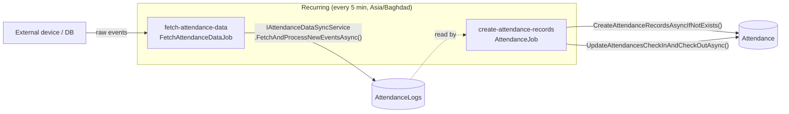

# Cross-cutting Concerns

Shared infrastructure used by every backend module. Most lives under
`original/AttendanceAppV2/src/Infrastructure/*` and `.../Web.Api/Middleware/*`.

## JWT authentication

- **Password hashing** (`Infrastructure/Authentication/PasswordHasher.cs`): PBKDF2 / **SHA-512**,
  **500,000 iterations**, 16-byte salt, 32-byte hash. Stored as `HEX(hash)-HEX(salt)`. `Verify` uses
  `CryptographicOperations.FixedTimeEquals` (constant-time compare).
- **Token issuance** (`Infrastructure/Authentication/TokenProvider.cs`): symmetric `HmacSha256` JWT
  signed with `Jwt:Secret`; claims = `sub` (user id), `Role`, `UserLogin`; `Issuer`/`Audience`/expiry
  from config (`Jwt:ExpirationInMinutes`).
- **Current-user access** (`Infrastructure/Authentication/UserContext.cs`): `IUserContext.UserId`
  reads the `sub` claim via `ClaimsPrincipalExtensions`; `GetUserAsync()` loads the full `UserInfoDto`
  (role, org unit, status) from the DB. `ClaimsPrincipalExtensions.GetRole()` exposes the `Role` claim
  used by endpoint policies.

### Login (sequence)

```mermaid
sequenceDiagram
    actor Client
    participant API as POST auth/login (AllowAnonymous, rate-limit "fixed")
    participant H as LoginCommandHandler
    participant DB as Users table
    participant PH as PasswordHasher
    participant TP as TokenProvider

    Client->>API: { userLogin, password }
    API->>H: LoginCommand
    H->>DB: find user by user_login (NoTracking)
    alt not found
        H-->>Client: Failure NotFoundByUserLogin
    end
    H->>PH: Verify(password, user.PasswordHash)  %% PBKDF2-SHA512, 500k iters
    alt mismatch
        H-->>Client: Failure InvalidCredentials
    end
    H->>TP: Create(user)  %% HS256 JWT with sub/Role/UserLogin
    H->>DB: set LastLoginDate = UtcNow ; SaveChanges
    H-->>Client: ApiResponse { Token, UserId, LastLoginDate }
```

## Permission-based authorization

`Infrastructure/Authorization/` implements an ASP.NET Core permission policy stack:
`HasPermissionAttribute`, `PermissionRequirement` / `PermissionAuthorizationHandler`,
`MultiplePermissionsRequirement` / `MultiplePermissionsAuthorizationHandler`, a dynamic
`PermissionAuthorizationPolicyProvider`, and `PermissionProvider`.

> **Current state**: `PermissionProvider.GetForUserIdAsync` returns an empty set (a `TODO` stub), so
> the permission machinery is wired but not enforcing. The **effective** authorization in production
> is **role-based**: each endpoint declares
> `.RequireAuthorization(policy => policy.RequireAssertion(ctx => ...))` that checks the JWT `Role`
> claim against an allow-list (e.g. `["Admin","SuperAdmin"]`), case-insensitively. Anonymous endpoints
> use `.AllowAnonymous()`.

## Redis caching

`Infrastructure/Caching/CacheService.cs` implements `ICacheService` over `IDistributedCache`
(Redis, host port 6378 locally). `Get/Set/Remove` with System.Text.Json serialization to UTF-8 bytes;
`CacheOptions.Create(expiration)` builds the `DistributedCacheEntryOptions`. The Application layer
defines a caching abstraction/behavior under `Application/Abstractions/Caching`.

## Logging — Serilog + Seq

Structured logging via **Serilog**, with **Seq** as the sink (http://localhost:8081 locally).
`Web.Api/Middleware/RequestContextLoggingMiddleware.cs` enriches the log context per request;
`SecurityLoggingMiddleware.cs` records security-relevant events. Background jobs log start/success/error
through `ILogger<T>`.

## Hangfire background jobs

`Infrastructure/BackgroundJobs/` — configured by `HangfireConfiguration.cs`; recurring jobs registered
by `HangfireJobScheduler.ScheduleRecurringJobs()`. Dashboard at `/hangfire`. **Both recurring jobs run
every 5 minutes** (cron `*/5 * * * *`) in the **Asia/Baghdad** time zone.



- **`FetchAttendanceDataJob`** (`FetchAttendanceDataJob.cs`) — pulls new device events into
  `AttendanceLogs` via `IAttendanceDataSyncService`.
- **`AttendanceJob`** (`AttendanceJob.cs`) — ensures a daily `Attendance` row per active employee, then
  folds the logs (earliest In / latest Out) into those rows via `IAttendanceProcessingService`.

## Blob storage

`Infrastructure/Storage/BlobService.cs` implements `IBlobService` over Azure Blob (Azurite locally,
port 10000), container **`files`** with `PublicAccessType.None`. `UploadAsync` returns a new `Guid`
file id (the blob name); `DownloadAsync` returns stream + content type; `DeleteAsync` removes it. All
methods return the `Result` type and map failures to `FileErrors`.

## Time / timezone

`Infrastructure/Time/DateTimeProvider.cs` implements `IDateTimeProvider`, default zone
**`Asia/Baghdad`**. Key members: `Now` (local wall-clock), `GetUtcNow()`, `ConvertToLocalTime` /
`ConvertToUtc`, and `EnsureUtc(dateTime)` which normalizes any `DateTimeKind` to UTC. It falls back to
alternative Windows/IANA zone ids if the requested id is missing. **Persisted timestamps are UTC**;
business handlers call `EnsureUtc` before saving and derive "today" from `Now`.

## Security middleware

`Web.Api/Middleware/` provides a defense-in-depth pipeline (the project README refers to this as the
"security middleware"; it is implemented as several focused middlewares):

- **`RateLimitingMiddleware.cs`** — in-memory per-client (IP-based, honoring `X-Real-IP` /
  `X-Forwarded-For`) sliding window using `SecurityOptions.RateLimiting` (`MaxRequestsPerMinute`,
  `MaxRequestsPerHour`, `BlockDurationMinutes`); returns **429** with `Retry-After`. Endpoints also use
  ASP.NET rate-limiter policies (`"per-user"`, `"fixed"`).
- **`IpBlockingMiddleware.cs`** — blocks IPs showing suspicious user-agents (sqlmap, nikto, burp, …),
  attack URL/header patterns (`../`, `/.env`, `UNION`, `<script`, …), empty UAs, or oversized URLs;
  after `10` suspicious hits in `15` min it blocks the IP for `24` h and returns **403**.
- Plus `SecurityHeadersMiddleware`, `CsrfProtectionMiddleware`, `SqlInjectionProtectionMiddleware`,
  `RequestValidationMiddleware`, `SecurityLoggingMiddleware`, `RequestContextLoggingMiddleware`.

## Domain events

`Infrastructure/DomainEvents/DomainEventsDispatcher.cs` (`IDomainEventsDispatcher`) dispatches domain
events on save. Event types exist for attendance and attendance-logs (created/checked-in/checked-out/
approved, verified/rejected), though several attendance handlers currently mutate state directly
without raising them.

## Where this is referenced

Every module doc links back here: [attendance](./attendance.md), [attendance-logs](./attendance-logs.md),
[attendance-schedules](./attendance-schedules.md), [leaves](./leaves.md), and the
[module map](./README.md).
