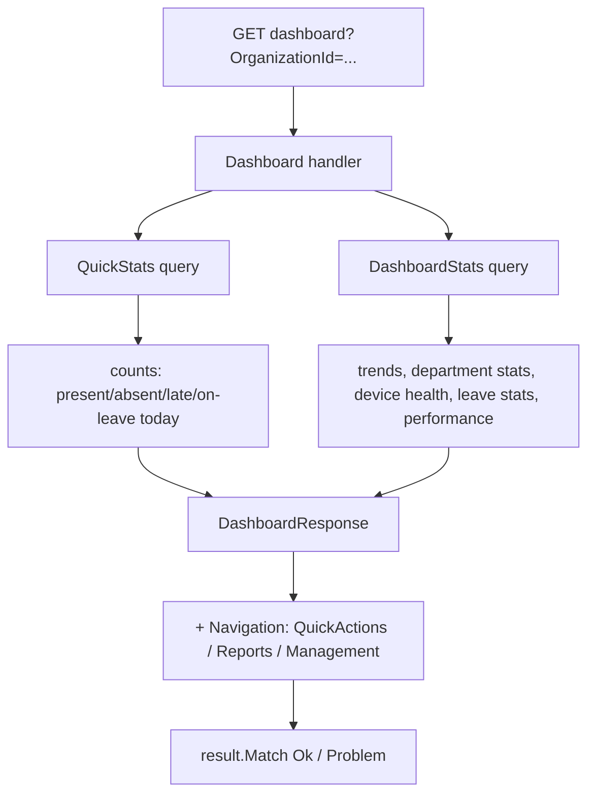
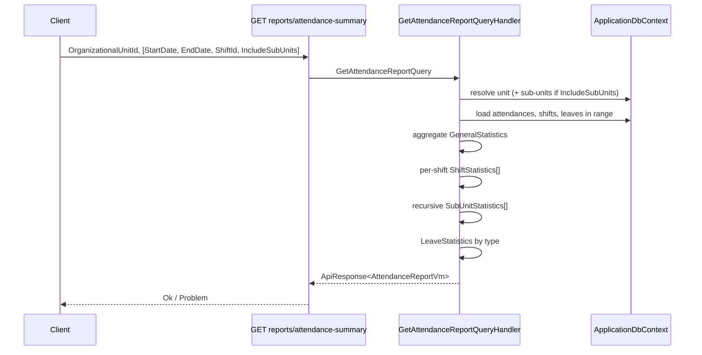

# Dashboard & Reports

## 1. Purpose

Read-only aggregation endpoints that turn raw attendance/leave/device data into management-facing
summaries:

- **Dashboard** — near-real-time, organization-scoped KPI snapshots for the home screen
  (today's present/absent/late counts, device health, trends).
- **Reports** — heavier, date-ranged, hierarchical breakdowns of attendance, with sub-unit and
  shift detail, suitable for export.

Both are query-only (CQRS `IQueryHandler`s) and read from `IApplicationDbContext`. They sit on top
of the attendance, leaves, organizations and devices modules.

> **Required query params (per CLAUDE.md gotcha):** a missing **required** param surfaces as a
> **500**, not a 400. Dashboard endpoints require **`OrganizationId`**; report endpoints require
> **`OrganizationalUnitId`** (note the different name).

## 2. Key types

These are response view models, not persisted entities:
- `DashboardResponse` — composite of `QuickStatsResponse` + `DashboardStatsResponse` + navigation.
- `QuickStatsResponse` — `TotalEmployees, PresentToday, AbsentToday, LateToday, OnLeaveToday,
  AttendanceRate, PendingApprovals, OnlineDevices, OfflineDevices, ActiveAlerts,
  AverageWorkingHours, …`.
- `DashboardStatsResponse` — overall counts + nested `AttendanceStats`, `AttendanceTrends`
  (daily/weekly/monthly), `DepartmentStats[]`, `DeviceStats`, `LeaveStats`, `LeaveTypeStats[]`,
  `PerformanceMetrics`, `TopPerformers[]`, recent activities and alerts.
- `AttendanceReportVm` — `GeneralStatistics`, `ShiftStatistics[]`, `SubUnitStatistics[]` (recursive),
  `LeaveStatistics`.
- `GetOrganizationReportVm` — totals + `Units[]` (`UnitSummary`) + paged `EmployeeDetails[]`.
- `OrganizationalSummaryVm` — totals + `Units[]` (`UnitSummary`), no per-employee detail.

## 3. Endpoints

Tag values are `Dashboard` / `Reports`; `per-user` rate limit; roles enforced inline via the JWT
`Role` claim. See [./cross-cutting.md](./cross-cutting.md).

### Dashboard — `Endpoints/Dashboard/*`
| Method | Route | Required params | Optional params | Handler / response | Auth |
|---|---|---|---|---|---|
| GET | `dashboard` | `OrganizationId` | `Date`, `StartDate`, `EndDate`, `DepartmentId`, `EmployeeId` | composite `DashboardResponse` | Admin, Employee, Manager, SuperAdmin |
| GET | `dashboard/stats` | `OrganizationId` | `StartDate`, `EndDate`, `DepartmentId`, `EmployeeId` | `DashboardStatsResponse` | Admin, SuperAdmin |
| GET | `dashboard/quick-stats` | `OrganizationId` | `Date` | `ApiResponse<QuickStatsResponse>` | Admin, SuperAdmin |

### Reports — `Endpoints/Reports/*`
| Method | Route | Required params | Optional params | Handler / response | Auth |
|---|---|---|---|---|---|
| GET | `reports/attendance-summary` | `OrganizationalUnitId` | `StartDate`, `EndDate`, `ShiftId`, `IncludeSubUnits` (default true) | `ApiResponse<AttendanceReportVm>` | Admin, Employee, Manager, SuperAdmin |
| GET | `reports/organization` | `OrganizationalUnitId` | `Date`, `ShiftId`, `IncludeSubUnits` (true), `SearchTerm`, `PageNumber` (1), `PageSize` (10) | `ApiResponse<GetOrganizationReportVm>` | Admin, Employee, Manager, SuperAdmin |
| GET | `reports/organizational-summary` | — (`OrganizationalUnitId` optional) | `IncludeSubUnits` (true), `Date` | `ApiResponse<OrganizationalSummaryVm>` | Admin, Employee, Manager, SuperAdmin |

> The three Reports endpoints carry Arabic OpenAPI summaries (e.g. تقرير الحضور الشامل) and live
> under tag `Reports`.

### Attendance reports (Application layer)
`Application/Features/Attendance/Reports/*` defines six richer report queries — `GetAttendanceReport`,
`GetLateReport`, `GetAbsenceReport`, `GetLeaveReport`, `GetOvertimeReport`,
`GetComprehensiveAttendanceReport`. Each takes **required** `StartDate`, `EndDate`, `ReportType`
plus optional org/unit/employee filters and an `ExportFormat`, and returns statistics +
per-employee + per-department summaries. These are not all mapped to the `Endpoints/Reports/*`
routes above; treat them as the reporting feature library.

## 4. Flows

### Dashboard composition

### Attendance report (hierarchical)

## 5. Cross-cutting touchpoints

See [./cross-cutting.md](./cross-cutting.md):
- **CQRS / Result** — query handlers + `result.Match(Ok, Problem)`.
- **Authorization** — inline role allow-lists; `dashboard/stats` and `dashboard/quick-stats` are
  Admin/SuperAdmin only, while `dashboard` and all reports also allow Employee/Manager.
- **DbContext** — read-only aggregation over attendance, leaves, devices, org-units.
- **Validation gotcha** — required query params (`OrganizationId` / `OrganizationalUnitId`) missing →
  500, not 400.
- Pulls from [./organizations.md](./organizations.md) (unit tree/shifts), the attendance/leaves
  modules, and [./devices.md](./devices.md) (device health stats).

## 6. Source map

**Endpoints (Web.Api)**
- `src/Web.Api/Endpoints/Dashboard/Dashboard.cs`, `GetDashboardStats.cs`, `GetQuickStats.cs`
- `src/Web.Api/Endpoints/Reports/GetAttendanceReport.cs`, `GetOrganizationReport.cs`,
  `GetOrganizationalSummary.cs` (+ `README.md`)

**Features (Application)**
- `src/Application/Features/Dashboard/GetDashboardStats/*`, `GetQuickStats/*`
- `src/Application/Features/Reports/GetAttendanceReport/*`, `GetOrganizationReport/*`,
  `GetOrganizationalSummary/*`
- `src/Application/Features/Attendance/Reports/*` — `GetAttendanceReport/`, `GetLateReport/`,
  `GetAbsenceReport/`, `GetLeaveReport/`, `GetOvertimeReport/`, `GetComprehensiveAttendanceReport/`
