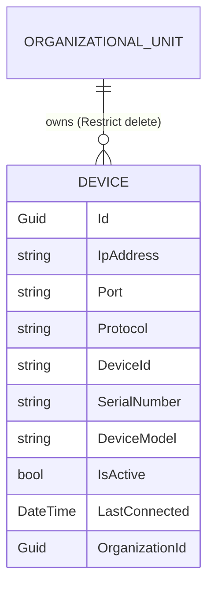
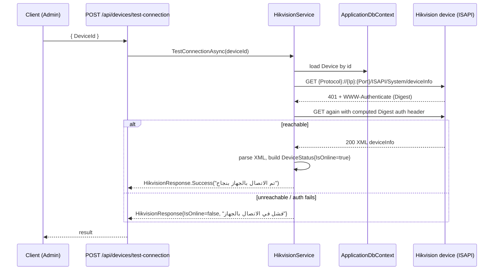
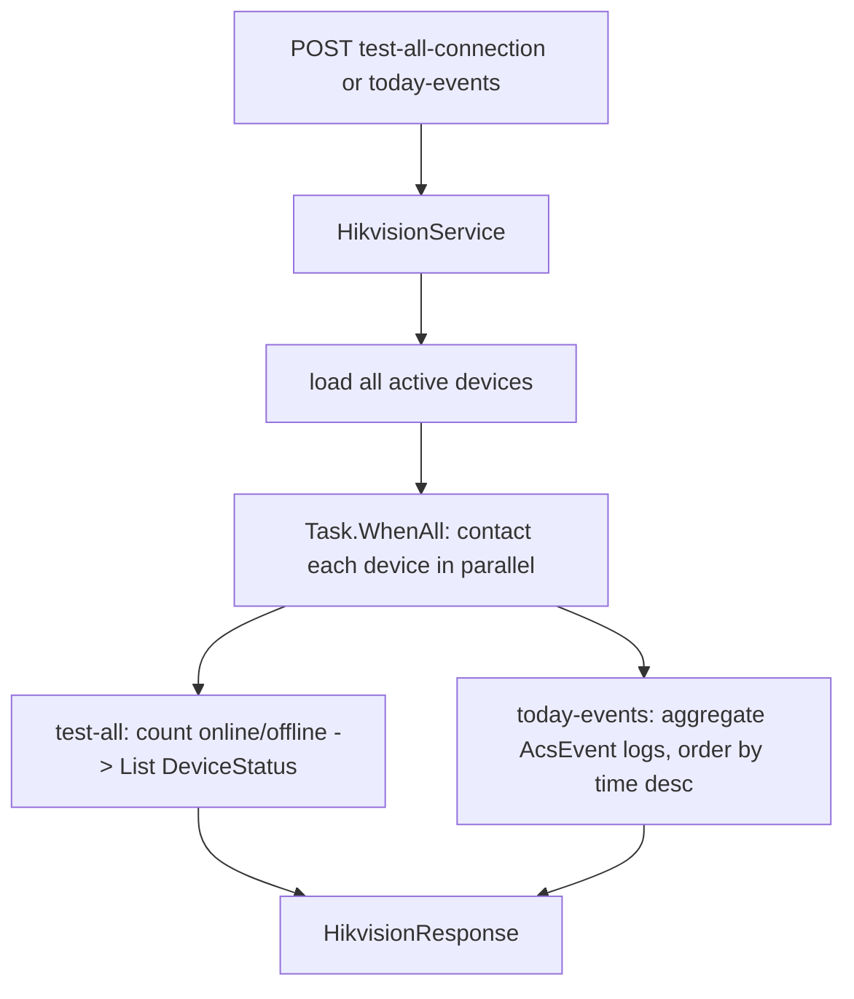

# Devices

## 1. Purpose

The **Devices** module is the registry of biometric / face-recognition terminals (Hikvision
hardware) that emit the punch events feeding attendance. It provides CRUD over the `Device` entity
plus **connectivity testing** and **event polling** that reach out to the physical devices over
their ISAPI HTTP interface.

The wire-level integration (digest auth, ISAPI URLs, XML/JSON parsing) lives in
`HikvisionService` and is documented in detail in
[../integrations/hikvision-devices.md](../integrations/hikvision-devices.md). This page covers the
registry, the entity, and the endpoint surface.

## 2. Key entities / types

### Device (`Domain/Entities/Devices/Device.cs`)
- Connectivity: `IpAddress` (required), `Port`, `Protocol` (`http`/`https`), `DeviceId`
  (unique index), `Username`, `Password`, `IsupKey`.
- Identity: `SerialNumber` (unique), `MacAddress`, `FirmwareVersion`, `DeviceModel`.
- Admin: `Location`, `Department`, `Features` (JSON), `IsActive`, `LastConnected`.
- **Relationship**: `OrganizationId → Organization (OrganizationalUnit)`, optional, with
  `DeleteBehavior.Restrict` — a unit cannot be deleted while devices reference it.

### Enum (`Domain/Enums/DeviceStatusEnum.cs`)
- `DeviceStatus`: `Online=0` (متصل), `Offline=1` (غير متصل), `Maintenance=2` (صيانة).

## 3. Endpoints

All under `Endpoints/Devices/*`, tag `Devices`, `per-user` rate limit. Roles enforced inline via
the JWT `Role` claim. Note that **CRUD + test routes use the bare `devices` prefix**, while the
three Hikvision-backed action routes use an `/api/devices/...` prefix.

| Method | Route | Handler | Auth |
|---|---|---|---|
| GET | `devices` | `GetDevicesQuery` → `PaginatedResponse<DeviceResponse>` | Admin, SuperAdmin |
| GET | `devices/{id:guid}` | `GetDeviceByIdQuery` → `DeviceResponse` | Admin, Employee, Manager, SuperAdmin |
| POST | `devices` | `CreateDeviceCommand` → `bool` | Admin, SuperAdmin |
| PUT | `devices/{id:guid}` | `UpdateDeviceCommand` → `bool` | Admin, SuperAdmin |
| DELETE | `devices/{id:guid}` | `DeleteDeviceCommand` | Admin, SuperAdmin |
| POST | `/api/devices/test-connection` | `{DeviceId}` → `IHikvisionService.TestConnectionAsync` → `HikvisionResponse<DeviceStatus>` | Admin, SuperAdmin |
| POST | `/api/devices/test-all-connection` | (no body) → `IHikvisionService.TestAllDevicesConnectionAsync` → `HikvisionResponse<List<DeviceStatus>>` | Admin, SuperAdmin |
| POST | `/api/devices/today-events` | `{StartTime?, EndTime?}` → `IHikvisionService.GetTodayEventsAsync` → `HikvisionResponse<AccessLogSearchResult>` | Admin, SuperAdmin |

**Create validation** (`CreateDeviceCommandHandler`): IP format (`IPAddress.TryParse`), IP
uniqueness, serial-number uniqueness, and existence of `OrganizationId` if supplied; raises
`DeviceCreatedDomainEvent`.

## 4. Flows

### Single-device connectivity test

### Test-all / today-events fan-out

## 5. Cross-cutting touchpoints

See [./cross-cutting.md](./cross-cutting.md):
- **CQRS / Result** — CRUD endpoints resolve command/query handlers and `result.Match(Ok, Problem)`.
- **Validation** — `CreateDeviceCommandValidator` etc. in the decorator pipeline.
- **Domain events** — `DeviceCreatedDomainEvent` dispatched post-save.
- **DbContext** — `IApplicationDbContext.Devices`; `Restrict` delete protects org-unit integrity.
- **Authorization** — inline role allow-lists; all device actions are Admin/SuperAdmin except
  single-device read.
- **Integration** — `IHikvisionService` (`HikvisionService`) performs digest-auth ISAPI calls;
  see [../integrations/hikvision-devices.md](../integrations/hikvision-devices.md).

## 6. Source map

**Entity / enum**
- `src/Domain/Entities/Devices/Device.cs`
- `src/Domain/Enums/DeviceStatusEnum.cs`

**Features (Application)**
- `src/Application/Features/Devices/Devices/*` — `Create/`, `Delete/`, `Get/`, `GetById/`, `Update/`
- `src/Application/Abstractions/Data/IHikvisionService.cs`
- `src/Application/Models/HikvisionModels.cs`

**Endpoints (Web.Api)**
- `src/Web.Api/Endpoints/Devices/*.cs` — `Create.cs`, `Update.cs`, `Delete.cs`, `Get.cs`,
  `GetById.cs`, `TestSingleConnection.cs`, `TestAllConnections.cs`, `GetTodayEvents.cs`

**Integration infra**
- `src/Infrastructure/Services/HikvisionService.cs`
- `src/Infrastructure/Configuration/Devices/DeviceConfiguration.cs`
