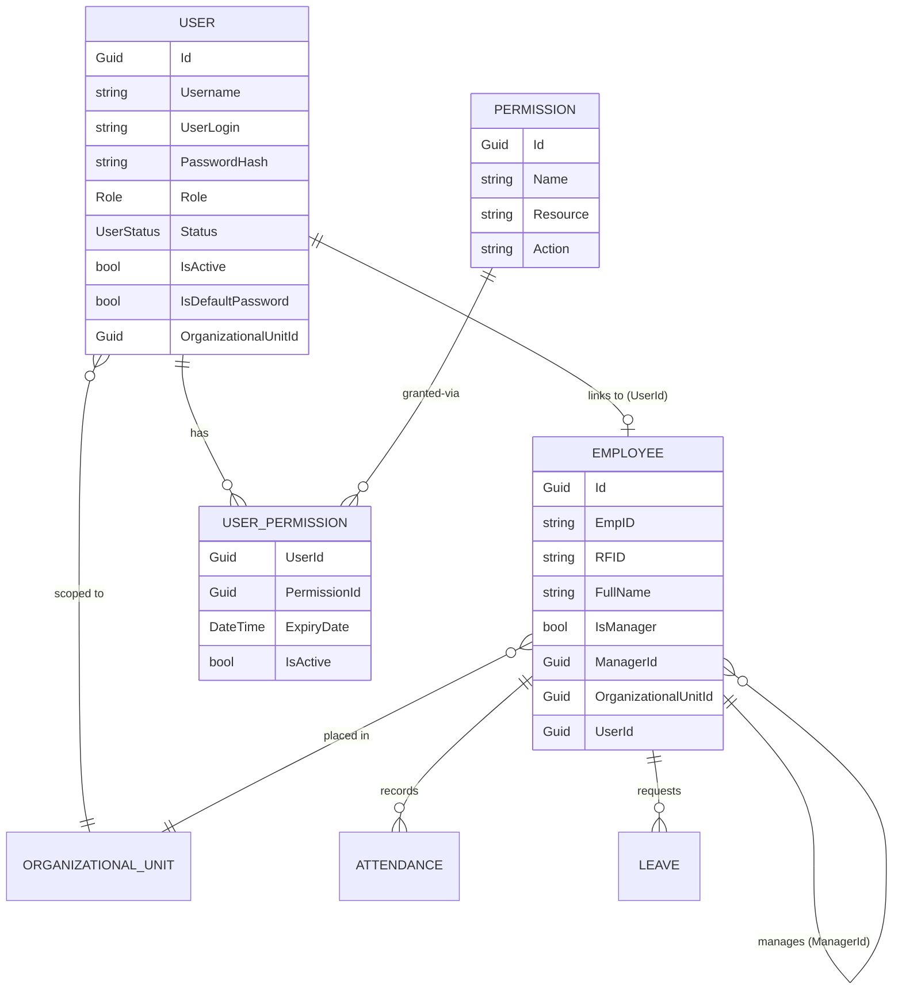
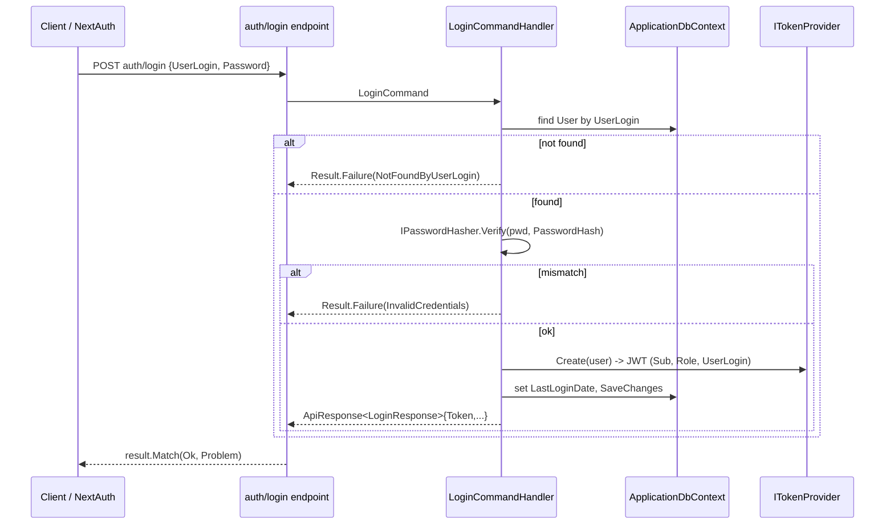
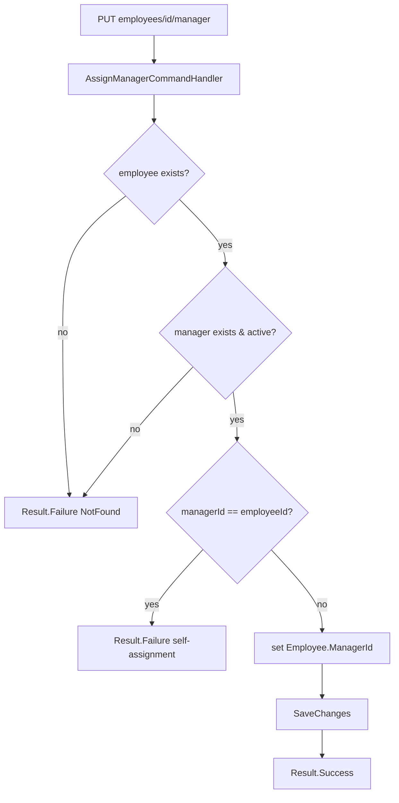
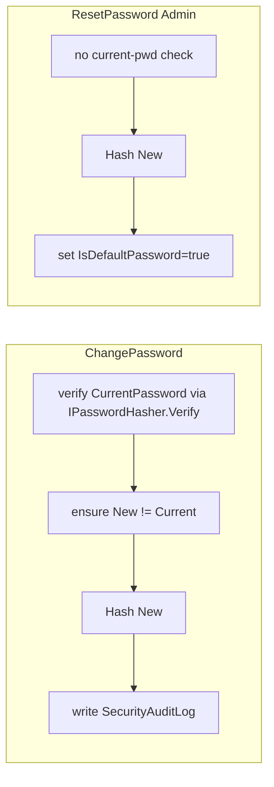

# Employees & Users

> Two tightly-coupled modules documented together because a `User` (a login account) optionally
> links to an `Employee` (HR master record), and most management endpoints are role-gated by the
> `User`'s role.

## 1. Purpose

- **Employees** — the workforce master data. Every person tracked by attendance (5,217 in the
  restored dump) is an `Employee`: identity (names, `EmpID`, `RFID`), org placement
  (`OrganizationalUnitId`), a self-referencing manager chain, and biometric/ID image URLs.
  Attendance, schedules and leaves all hang off `Employee`.
- **Users** — authentication and authorization accounts. A `User` carries a `UserLogin`/password,
  a `Role`, a `Status`, and an optional `OrganizationalUnitId` scope. Login issues the JWT every
  other endpoint consumes; `Permission`/`UserPermission` provide fine-grained, per-user grants on
  top of the coarse role check.

Both modules sit in the **Organizations** / **Users** domains and are exposed via thin minimal-API
endpoints that delegate to CQRS handlers (see [./cross-cutting.md](./cross-cutting.md)).

## 2. Key entities / types

### Employee (`Domain/Entities/Organizations/Employee.cs`)
- Identity: `EmpID` (unique), `Code`, `RFID`, name parts (`FirstName`…`FamilyName`), `FullName`, `Email`.
- Flags / media: `IsManager`, `FaceImageUrl`, `NationalIdFrontUrl`, `NationalIdBackUrl`, `ProfileImageUrl`.
- Relationships:
  - `OrganizationalUnitId → OrganizationalUnit` (placement, many-to-one).
  - `ManagerId → Manager (Employee)` **self-reference**; reverse collection `Subordinates`.
  - `UserId → User` (optional one-to-one link to a login account).
  - Collections: `Attendances`, `AttendanceSchedules`, `Leaves`, `ManagedUnits`.

### User (`Domain/Entities/Users/User.cs`)
- `Username` (display), `UserLogin` (login lookup key), `PasswordHash` (PBKDF2-SHA512, format
  `HEX(hash)-HEX(salt)`), `Role`, `IsActive`, `Status`, `IsDefaultPassword`, `LastLoginDate`.
- `OrganizationalUnitId → OrganizationalUnit` (scope); `UserPermissions` collection.

### Permission / UserPermission (`Domain/Entities/Users/Permission.cs`, `UserPermission.cs`)
- `Permission`: `Name`, `Resource`, `Action` (e.g. Read/Create), `IsActive`, JSONB `Metadata`.
- `UserPermission`: join row `UserId`+`PermissionId` with optional `ExpiryDate`, `IsActive`.

### Enums (`Domain/Enums/`)
- `Role` (`RolesEnum.cs`): `Admin=1, User=2, Manager=3, Employee=4, Guest=5, HR_Manager=6,
  Viewer=7, SuperAdmin=8, SystemUser=9, SystemManager=10`.
- `UserStatus` (`UserStatusEnum.cs`): `Active=1, Inactive, Pending, Locked, Expired, Deleted,
  Suspended, Archived`.

## 3. Endpoints

Roles below are enforced inline via `RequireAuthorization(policy => policy.RequireAssertion(...))`,
which reads the `Role` claim from the JWT (`context.User.GetRole()`) and matches case-insensitively
against an allow-list. All authenticated endpoints use the `per-user` rate-limit policy; `auth/login`
uses `fixed`.

### Auth — `Endpoints/Auth/*`
| Method | Route | Handler | Auth |
|---|---|---|---|
| POST | `auth/login` | `LoginCommand` → `ApiResponse<LoginResponse>` (Token, UserId, LastLoginDate) | **AllowAnonymous** (`fixed` limit) |
| POST | `auth/register` | `RegisterEmployeeCommand` (`[FromForm]`, uploads `FaceImage` via `IBlobService`) → `Created employees/{id}` | Admin, SuperAdmin |

> `auth/register` is the employee-registration entry point: it creates an `Employee` (not a `User`)
> and stores the face image in blob storage — see [./files-and-attachments.md](./files-and-attachments.md).

### Employees — `Endpoints/Employees/*`
| Method | Route | Handler | Auth |
|---|---|---|---|
| GET | `employees` | `GetEmployeesQuery` → `PaginatedResponse<EmployeeResponse>` | Admin, Employee, Manager, SuperAdmin |
| GET | `employees/search` | `SearchEmployeeQuery` → `PaginatedResponse<EmployeeResponse>` | Admin, Manager, SuperAdmin, SecurityOfficer, OrgSupervisor — unit-scoped for non-Admin; PageSize ≤ 100; sensitive columns Admin-only |
| GET | `employees/{id:guid}` | `GetEmployeeByIdQuery` → `ApiResponse<GetEmployeeByIdVm>` | Admin, Employee, Manager, SuperAdmin |
| GET | `employees/profile` | `GetProfileQuery` → `ProfileResponse` | Admin, Employee, Manager, SuperAdmin |
| PUT | `employees/{id:guid}` | `UpdateEmployeeCommand` | Admin, SuperAdmin |
| PUT | `employees/profile` | `UpdateProfileCommand` | Admin, SuperAdmin |
| PUT | `employees/{id:guid}/manager` | `AssignManagerCommand` | Admin, SuperAdmin |
| PUT | `employees/{id:guid}/role` | `UpdateUserRoleCommand` → `ApiResponse<bool>` | Admin, SuperAdmin |
| POST | `employees/change-password` | `ChangePasswordCommand` → `ApiResponse<bool>` | Admin, SuperAdmin |
| DELETE | `employees/{id:guid}` | `DeleteEmployeeCommand` (soft delete) | Admin, SuperAdmin |

### Users — `Endpoints/Users/*`
| Method | Route | Handler | Auth |
|---|---|---|---|
| GET | `users` | `GetUsersQuery` → `PaginatedResponse<UserResponse>` | Admin, SuperAdmin |
| GET | `users/{id:guid}` | `GetUserByIdQuery` → `UserResponse` | Admin, SuperAdmin |
| GET | `users/me` | reads `IUserContext` → `UserInfoDto` | Admin, Employee, Manager, SuperAdmin |
| POST | `users/new` | `SignUpCommand` → `ApiResponse<SignUpResponse>` | Admin, SuperAdmin |
| POST | `users/change-password` | `ChangePasswordCommand` → `ApiResponse<bool>` | Admin, Employee, Manager, SuperAdmin |
| POST | `users/reset-password` | `ResetPasswordCommand` → `bool` | Admin, SuperAdmin |
| PUT | `users/{id:guid}` | `UpdateUserCommand` | Admin, SuperAdmin |
| PUT | `users/{id:guid}/role` | `UpdateUserRoleCommand` → `ApiResponse<bool>` | Admin, SuperAdmin |
| DELETE | `users/{id:guid}` | `DeleteUserCommand(id, currentUser.Id)` (uses `IUserContext`) | Admin, SuperAdmin |

## 4. Flows

### Login → JWT

### Assign manager (self-referencing chain)

### Change / reset password

## 5. Cross-cutting touchpoints

See [./cross-cutting.md](./cross-cutting.md) for details on each:
- **CQRS / Result** — every endpoint resolves an `ICommandHandler`/`IQueryHandler` and returns
  `result.Match(Results.Ok, CustomResults.Problem)`.
- **Authentication** — `IPasswordHasher` (PBKDF2-SHA512, 500k iters), `ITokenProvider` (JWT with
  `Sub`/`Role`/`UserLogin` claims), `IUserContext` (`users/me`, delete-self guard),
  `ClaimsPrincipalExtensions.GetRole()`.
- **Authorization** — inline role allow-lists; `Permission`/`UserPermission` back the dynamic
  `HasPermission` policy provider.
- **Validation** — FluentValidation validators run in the `ValidationDecorator` pipeline.
- **Auditing** — password/role changes append `SecurityAuditLog` rows.
- **Blob storage** — `auth/register` and profile updates push images through `IBlobService`.
- **Rate limiting** — `per-user` (token bucket) for authenticated routes, `fixed` for login.

## 6. Source map

**Entities**
- `src/Domain/Entities/Organizations/Employee.cs`
- `src/Domain/Entities/Users/User.cs`, `Permission.cs`, `UserPermission.cs`
- `src/Domain/Enums/RolesEnum.cs`, `UserStatusEnum.cs`

**Features (Application)**
- `src/Application/Features/Organizations/Employees/*` — `AssignManager/`, `Delete/`, `Get/`,
  `GetById/`, `Profile/`, `Registration/`, `Search/`, `Update/`
- `src/Application/Features/Users/*` — `Login/`, `SignUp/`, `Get/`, `GetById/`, `Update/`,
  `UpdateRole/`, `ChangePassword/`, `ResetPassword/`, `Delete/`

**Endpoints (Web.Api)**
- `src/Web.Api/Endpoints/Auth/Login.cs`, `Register.cs`
- `src/Web.Api/Endpoints/Employees/*.cs`
- `src/Web.Api/Endpoints/Users/*.cs`

**Authentication infra**
- `src/Infrastructure/Authentication/PasswordHasher.cs`, `TokenProvider.cs`,
  `ClaimsPrincipalExtensions.cs`, `UserContext.cs`
