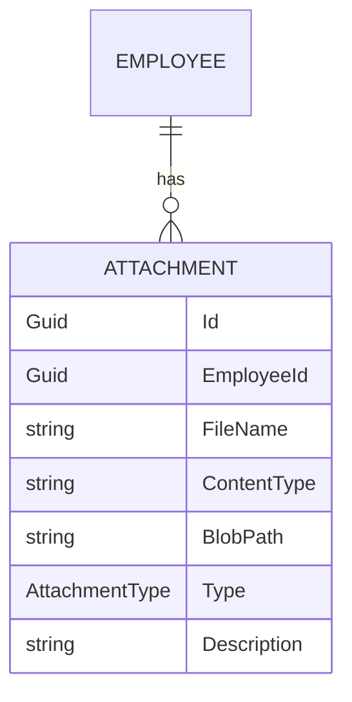
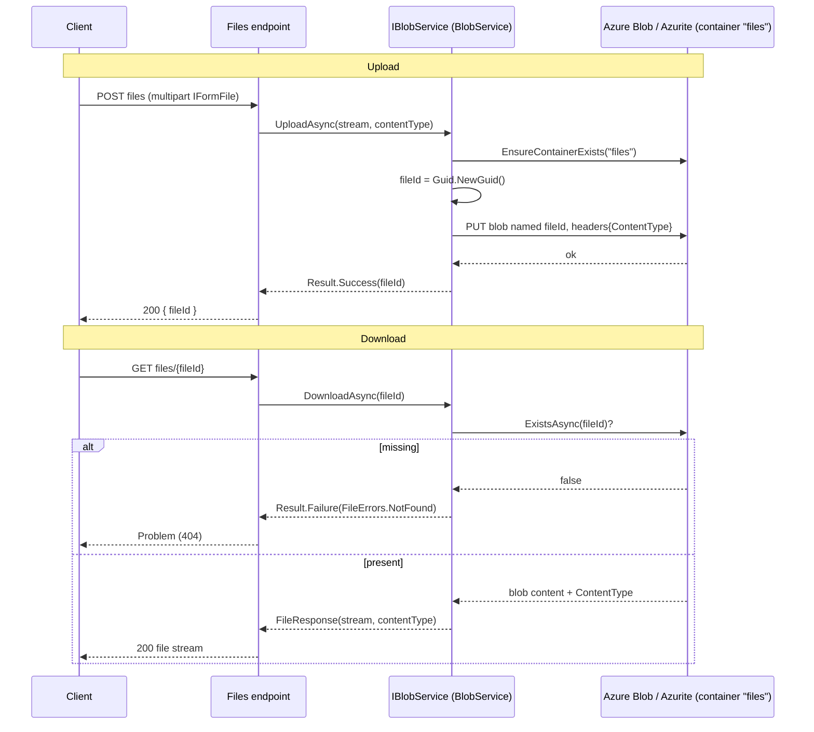

# Files & Attachments

## 1. Purpose

This module provides **binary storage** for the system: employee face images, national-ID scans and
document attachments. It has two layers:

- A generic **file storage abstraction** (`IBlobService`) backed by **Azure Blob Storage** — in
  local dev this is **Azurite** on port 10000. Three minimal-API endpoints (`POST/GET/DELETE files`)
  expose upload/download/delete by `Guid` file id.
- The **`Attachment`** domain entity, which records metadata (file name, content type, blob path,
  type) about a stored file and links it to an `Employee`.

`IBlobService` is the same dependency that `auth/register` and employee profile updates use to push
images (see [./employees-and-users.md](./employees-and-users.md)).

## 2. Key entities / types

### Attachment (`Domain/Entities/Organizations/Attachment.cs`)
- `EmployeeId → Employee` (required reference).
- `FileName`, `ContentType` (MIME), `BlobPath` (storage path/key), `Type` (`AttachmentType`),
  `Description?`.
- Factory `Create(...)` validates `FileName`/`ContentType`/`BlobPath` and raises
  `AttachmentCreatedDomainEvent`; `Update(...)` raises `AttachmentUpdatedDomainEvent`.
- Validation errors: `AttachmentErrors.FileNameRequired/ContentTypeRequired/BlobPathRequired`.

### Enum (`Domain/Enums/AttachmentTypeEnum.cs`)
- `AttachmentType`: `NationalIdFront=1, NationalIdBack=2, Other=3`.

### Storage abstraction (`Application/Storage/`)
- `IBlobService`:
  - `Task<Result<Guid>> UploadAsync(Stream, string contentType, ct)`
  - `Task<Result<FileResponse>> DownloadAsync(Guid fileId, ct)`
  - `Task<Result> DeleteAsync(Guid fileId, ct)`
- `FileResponse(Stream Stream, string ContentType)`.
- `FileErrors`: `NotFound(fileId)`, `UploadFailed`, `InvalidContentType`, `FileSizeExceeded`.

### Implementation (`Infrastructure/Storage/BlobService.cs`)
- Backed by `Azure.Storage.Blobs` (`BlobServiceClient`).
- Single container **`files`** (`PublicAccessType.None`), created on demand
  (`EnsureContainerExistsAsync`).
- **Blob name = `fileId.ToString()`** (the generated Guid). No folder structure.

## 3. Endpoints

All in `Endpoints/Files.cs`, tag `Files`, **`fixed`** rate-limit policy, `DisableAntiforgery()` on
upload. These file endpoints are **not** wrapped in a role assertion (unlike the rest of the API);
they are throttled rather than role-gated.

| Method | Route | Handler | Auth |
|---|---|---|---|
| POST | `files` | `IFormFile file` → `IBlobService.UploadAsync(stream, ContentType)` → `Guid` | none (rate-limited `fixed`) |
| GET | `files/{fileId:guid}` | `IBlobService.DownloadAsync(fileId)` → file stream + ContentType | none (`fixed`) |
| DELETE | `files/{fileId:guid}` | `IBlobService.DeleteAsync(fileId)` → `204 NoContent` | none (`fixed`) |

`Endpoints/Tags.cs` is a static class of Swagger tag string constants (`Auth`,
`OrganizationalUnits`, `Employees`, `Holidays`, `Shifts`, `Devices`, `Attendance`,
`AttendanceSchedules`, `AttendanceBreaks`, `Leaves`, `Reports`, `AttendanceLogs`, `Dashboard`,
`Users`, `Files`) — referenced by every endpoint's `.WithTags(...)`.

> **Attachment CRUD handlers** under `Application/Features/Organizations/Attachments/*` (Create,
> Upload, Get, GetById, Update, Delete) are currently **spec/README placeholders** — the `Attachment`
> entity and `IBlobService` are implemented, but those feature handlers are not yet wired to
> endpoints.

## 4. Flow

### Upload → blob → download

## 5. Cross-cutting touchpoints

See [./cross-cutting.md](./cross-cutting.md):
- **Result** — `IBlobService` returns `Result<T>`; endpoints `result.Match(...)` to ProblemDetails.
- **Domain events** — `AttachmentCreated/UpdatedDomainEvent` dispatched post-save.
- **Rate limiting** — file endpoints use the `fixed` policy (5 req/min) rather than `per-user`.
- **Consumers** — `auth/register` (face image) and employee profile updates reuse `IBlobService`;
  see [./employees-and-users.md](./employees-and-users.md).
- **Local infra** — Azurite blob emulator on host port `10000` (see root `CLAUDE.md`).

## 6. Source map

**Entity / enum**
- `src/Domain/Entities/Organizations/Attachment.cs`, `AttachmentErrors.cs`
- `src/Domain/Enums/AttachmentTypeEnum.cs`

**Storage abstraction (Application)**
- `src/Application/Storage/IBlobService.cs`, `FileResponse.cs`, `FileErrors.cs`

**Implementation (Infrastructure)**
- `src/Infrastructure/Storage/BlobService.cs`

**Endpoints (Web.Api)**
- `src/Web.Api/Endpoints/Files.cs`
- `src/Web.Api/Endpoints/Tags.cs`

**Features (placeholder)**
- `src/Application/Features/Organizations/Attachments/*`
