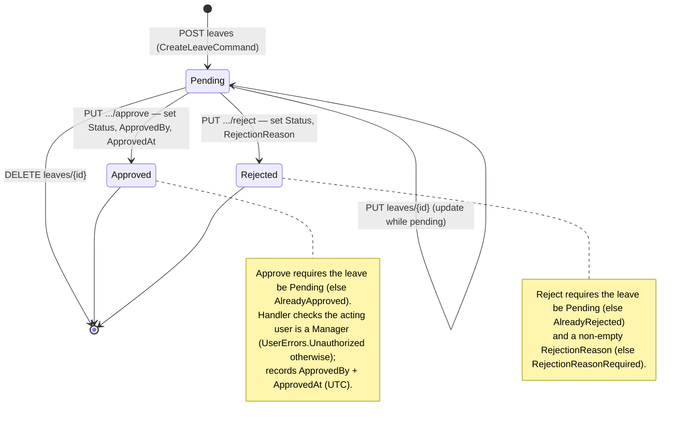

# Leaves Module

## 1. Purpose

The Leaves module manages **employee leave requests** through their lifecycle: an employee (or admin)
creates a request, a manager/admin approves or rejects it, and the request can be updated/deleted while
still pending. Approved leave is what other parts of the system (attendance metrics, the
`BreakType.Vacation` handling in check-in) treat as authorized absence.

## 2. Key entities / types

**`Leave`** (`Domain/Entities/Attendance/Leave.cs`, `AuditableEntity<Guid>`):
- `EmployeeId` (FK), `LeaveType` (`LeaveType`), `StartDate`, `EndDate`, `Reason`.
- `Status` (`LeaveStatus`).
- `ApprovedBy?` (user id), `ApprovedAt?`, `RejectionReason?`.
- Navigation: `Employee` (required).

> The entity is **anemic** — there are no `Approve()` / `Reject()` methods; the Application handlers
> mutate the fields directly. No domain events are raised.

**Enums**:
- `LeaveStatus`: `Pending(1)`, `Approved(2)`, `Rejected(3)`, `Cancelled(4)`, `Expired(5)`,
  `UnderReview(6)`.
- `LeaveType`: `None(0)`, `Ordinary(1)`, `Sick(2)`, `Emergency(3)`, `Maternity(4)`, `TimeOff(5)`,
  `Hajj(6)`, `Umrah(7)`, `Study(8)`, `Unpaid(9)`, `Compensatory(10)`, `Duty(11)`, `Night_Break(12)`,
  `Permitted(13)`, `Cycle(14)`, `Workshop(15)`.

`LeaveErrors` (`LeaveErrors.cs`) defines the guard messages: `NotFound`, `AlreadyApproved`,
`AlreadyRejected`, `AlreadyCancelled`, `CannotUpdate/DeleteApprovedLeave`, `RejectionReasonRequired`,
`UnauthorizedApproval/Rejection`, `OverlappingLeave`, `InsufficientLeaveBalance`, etc.

## 3. Endpoints

Base tag: `Leaves`. JWT role-claim policy + `per-user` rate limiting on every endpoint.

| Method | Route | Handler (Command/Query) | Roles allowed |
|---|---|---|---|
| POST | `leaves` | `CreateLeaveCommand` → `Guid` | Admin, SuperAdmin, Employee |
| PUT | `leaves/{id}` | `UpdateLeaveCommand` → `Guid` | Admin, SuperAdmin, Employee |
| PUT | `leaves/{id}/approve` | `ApproveLeaveCommand` → `Guid` | Admin, SuperAdmin, Employee |
| PUT | `leaves/{id}/reject` | `RejectLeaveCommand` → `Guid` | Admin, SuperAdmin, Manager |
| DELETE | `leaves/{id}` | `DeleteLeaveCommand` → `bool` | Admin, Employee, Manager, SuperAdmin |
| GET | `leaves` | `GetLeavesQuery` → `PaginatedResponse<LeaveResponse>` | Admin, Employee, Manager, SuperAdmin |
| GET | `leaves/{id}` | `GetLeaveByIdQuery` → `LeaveResponse` | Admin, Employee, Manager, SuperAdmin |

List query filters: `EmployeeId`, `ManagerId`, `StartDate`, `EndDate`, `LeaveType`, `Status`,
`SearchTerm`, `SortBy`, `SortOrder`, paging.

## 4. Flow — leave lifecycle (state)

**Asymmetry to be aware of** (from the handlers):
- *Approve* (`ApproveLeaveCommandHandler`) enforces the acting user has `Role.Manager`, and persists
  both `ApprovedBy` and `ApprovedAt`.
- *Reject* (`RejectLeaveCommandHandler`) currently has **no role check** (a TODO), stores
  `RejectionReason` but **does not persist who rejected or when** (`RejectedBy` from the command is
  not written; there is no rejection timestamp field).
- Both transitions require the leave to currently be `Pending`.

## 5. Cross-cutting touchpoints

- **Auth & authorization** — JWT role-claim policy on the endpoint; the approve handler additionally
  checks `Role.Manager` via `IUserContext`. See [cross-cutting.md](./cross-cutting.md#jwt-authentication).
- **Time** — `IDateTimeProvider.GetUtcNow()` stamps `ApprovedAt`. See
  [cross-cutting.md](./cross-cutting.md#time--timezone).
- **Attendance linkage** — approved leave maps to `BreakType.Vacation` handling consumed by the
  attendance calculation service (see [attendance.md](./attendance.md)).

## 6. Source map

- Domain entity: `original/AttendanceAppV2/src/Domain/Entities/Attendance/Leave.cs`
  (+ `LeaveErrors.cs`).
- Application handlers: `original/AttendanceAppV2/src/Application/Features/Attendance/Leaves/`
  (`Create/`, `Update/`, `Approve/`, `Reject/`, `Delete/`, `Get/`, `GetById/`).
- Web.Api endpoints: `original/AttendanceAppV2/src/Web.Api/Endpoints/Leaves/`.
