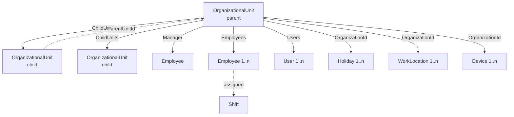
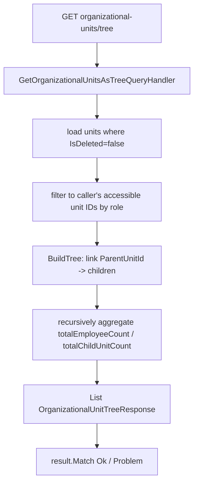
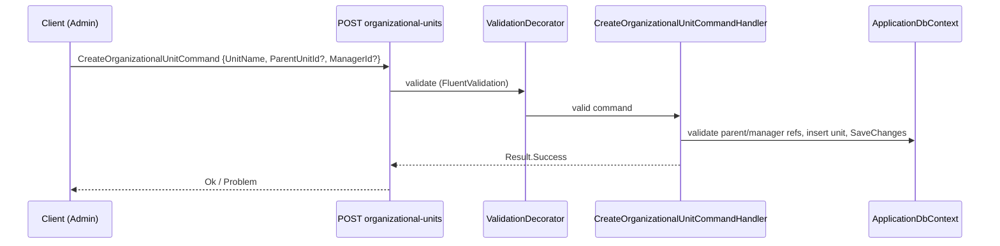

# Organizations

## 1. Purpose

The **Organizations** module models the structural backbone the rest of the system hangs off:

- **OrganizationalUnit** — a self-referencing hierarchical tree (Directorate → Department → Section
  → Office). Employees, users, devices, holidays and work locations are all scoped to a unit.
- **Shift** — named working-time windows (start/end, grace period, late tolerance) assigned to
  employees.
- **Holiday** — non-working days scoped to an organizational unit, optionally recurring.
- **WorkLocation** — geofenced sites (lat/long + radius, Wi-Fi SSID, beacon) used for
  location-verified attendance.

It sits in the **Organizations** domain and is consumed heavily by attendance, reports and the
dashboard (which all take an `OrganizationId`/`OrganizationalUnitId`).

## 2. Key entities / types

### OrganizationalUnit (`Domain/Entities/Organizations/OrganizationalUnit.cs`)
- Fields: `UnitName`, `UnitCode`, `UnitDescription`, `Email`, `PhoneNumber`, `Address`,
  `PostalCode`, `UnitLogo`, `UnitLevel`.
- **Self-reference**: `ParentUnitId → ParentUnit`; reverse collection `ChildUnits`.
- `ManagerId → Manager (Employee)`.
- Collections: `Employees`, `Users` (and indirectly `Holidays`, `WorkLocations`, `Devices` via
  their `OrganizationId`).

### Shift (`Domain/Entities/Organizations/Shift.cs`)
- `Name`, `StartTime`/`EndTime` (`TimeOnly`), `ShiftType`, `IsActive`, `Description`.
- Tolerances: `GracePeriodMinutes`, `MaxLateMinutes`, `AllowEarlyCheckIn`, `AllowLateCheckOut`.
- Collection: `Employees`.

### Holiday (`Domain/Entities/Organizations/Holiday.cs`)
- `OrganizationId → Organization (OrganizationalUnit)`, `Name`, `Date` (`DateOnly`), `IsRecurring`.

### WorkLocation (`Domain/Entities/Organizations/WorkLocation.cs`)
- `OrganizationId`, `Name`, `Address`, `Latitude`, `Longitude`, `RadiusMeters`, `IsActive`,
  `WifiSSID`, `BeaconId`. Business helper `IsWithinRadius(lat, long)` (Haversine).

### Enums (`Domain/Enums/`)
- `OrganizationType` (`OrganizationTypeEnum.cs`): `Directorate=1, Department=2, Section=3, Office=4`.
- `ShiftType` (`ShiftTypeEnum.cs`): `Morning=1, Afternoon, Evening, Night, Flexible, Custom`.

## 3. Endpoints

Role checks are inline JWT-role allow-lists (`context.User.GetRole()`), all under the `per-user`
rate-limit policy. See [./cross-cutting.md](./cross-cutting.md).

### OrganizationalUnits — `Endpoints/OrganizationalUnits/*` (base `organizational-units`)
| Method | Route | Handler | Auth |
|---|---|---|---|
| GET | `organizational-units` | `GetOrganizationalUnitsQuery` → flat `List<OrganizationalUnitResponse>` | Admin, Employee, Manager, SuperAdmin |
| GET | `organizational-units/tree` | `GetOrganizationalUnitsAsTreeQuery` → `List<OrganizationalUnitTreeResponse>` | Admin, Employee, Manager, SuperAdmin |
| GET | `organizational-units/{id:guid}` | `GetOrganizationalUnitByIdQuery` → `OrganizationalUnitResponse` | Admin, Employee, Manager, SuperAdmin |
| POST | `organizational-units` | `CreateOrganizationalUnitCommand` | Admin, SuperAdmin |
| PUT | `organizational-units/{id:guid}` | `UpdateOrganizationalUnitCommand` | Admin, SuperAdmin |
| DELETE | `organizational-units/{id:guid}` | `DeleteOrganizationalUnitCommand` (soft delete) | Admin, SuperAdmin |

> **`GET organizational-units/tree`** (`GetAsTree.cs`, documented in `GetAsTree.md`) is the special
> case: it loads non-deleted units, filters to the caller's role-accessible unit IDs, builds the
> hierarchy in-memory (`BuildTree()`), and recursively aggregates counts. Each
> `OrganizationalUnitTreeResponse` exposes manager info, **direct** `employeeCount`/`childUnitCount`,
> **aggregated** `totalEmployeeCount`/`totalChildUnitCount`, `hasChildren`, and a recursive
> `children` list.

### Shifts — `Endpoints/Shifts/*` (base `shifts`)
| Method | Route | Handler | Auth |
|---|---|---|---|
| GET | `shifts` | `GetShiftsQuery` → `PaginatedResponse<ShiftResponse>` (filters: `ShiftType`, `IsActive`, `SearchTerm`, `SortBy`) | Admin, Employee, Manager, SuperAdmin |
| GET | `shifts/{id:guid}` | `GetShiftByIdQuery` → `ApiResponse<ShiftResponse>` | Admin, Employee, Manager, SuperAdmin |
| POST | `shifts` | `CreateShiftCommand` | Admin, SuperAdmin |
| PUT | `shifts/{id:guid}` | `UpdateShiftCommand` | Admin, SuperAdmin |
| DELETE | `shifts/{id:guid}` | `DeleteShiftCommand` | Admin, SuperAdmin |

### Holidays — `Endpoints/Holidays/*` (base `holidays`)
| Method | Route | Handler | Auth |
|---|---|---|---|
| GET | `holidays` | `GetHolidaysQuery` → `PaginatedResponse<HolidayResponse>` (filters: `OrganizationId`, date range, `IsRecurring`, `SearchTerm`, sort) | Admin, Employee, Manager, SuperAdmin |
| GET | `holidays/{id:guid}` | `GetHolidayByIdQuery` → `ApiResponse<HolidayResponse>` | Admin, Employee, Manager, SuperAdmin |
| POST | `holidays` | `CreateHolidayCommand` | Admin, Employee, Manager, SuperAdmin |
| PUT | `holidays/{id:guid}` | `UpdateHolidayCommand` | Admin, Employee, Manager, SuperAdmin |
| DELETE | `holidays/{id:guid}` | `DeleteHolidayCommand` | Admin, Employee, Manager, SuperAdmin |

### WorkLocations
> **No HTTP endpoints are mapped.** The full CRUD feature set
> (`Application/Features/Organizations/WorkLocations/*`: Create, Get, GetById, Update, Delete) exists
> in the Application layer but is **not** exposed under `Endpoints/`. The entity and Haversine
> geofence logic are wired into attendance location verification, not a public surface.

## 4. Flows

### Build the org-unit tree

### Create a unit under a parent

## 5. Cross-cutting touchpoints

See [./cross-cutting.md](./cross-cutting.md):
- **CQRS / Result** — handler-per-endpoint, `result.Match(Ok, Problem)`.
- **Validation** — Create/Update commands have FluentValidation validators in the decorator pipeline.
- **Authorization** — inline role allow-lists; the tree query additionally filters to the caller's
  role-accessible units.
- **Soft delete** — `IsDeleted` flag honoured by queries (units/shifts/holidays).
- **Pagination** — shifts and holidays return `PaginatedResponse<T>`.
- **Devices** — units own devices; deleting a unit is restricted while devices reference it (see
  [./devices.md](./devices.md)).

## 6. Source map

**Entities**
- `src/Domain/Entities/Organizations/OrganizationalUnit.cs`, `Shift.cs`, `Holiday.cs`, `WorkLocation.cs`
- `src/Domain/Enums/OrganizationTypeEnum.cs`, `ShiftTypeEnum.cs`

**Features (Application)**
- `src/Application/Features/Organizations/OrganizationalUnits/*` — `Create/`, `Get/`, `GetAsTree/`,
  `GetById/`, `Update/`, `Delete/`
- `src/Application/Features/Organizations/Shifts/*`
- `src/Application/Features/Organizations/Holidays/*`
- `src/Application/Features/Organizations/WorkLocations/*` (no endpoints)
- `src/Application/Features/Organizations/UnitWorkHours/*` (placeholder; README-only)

**Endpoints (Web.Api)**
- `src/Web.Api/Endpoints/OrganizationalUnits/*.cs` (note `GetAsTree.cs` + `GetAsTree.md`)
- `src/Web.Api/Endpoints/Shifts/*.cs`
- `src/Web.Api/Endpoints/Holidays/*.cs`
