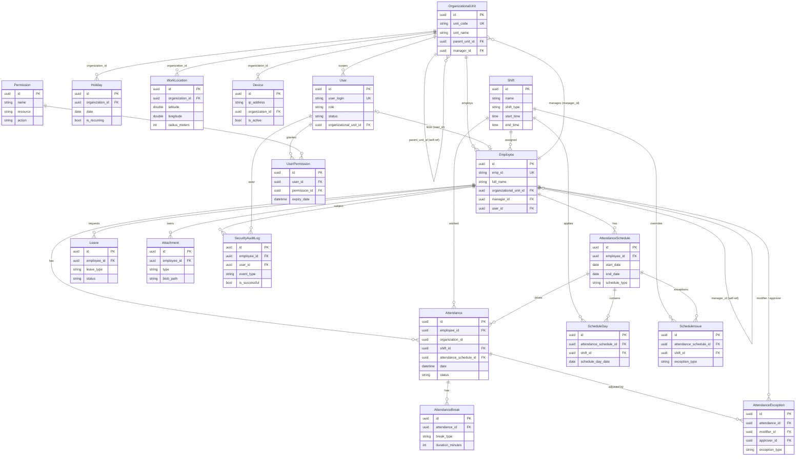

# Entity-Relationship Diagram (public schema)

The diagram below covers the first-party `public`-schema tables managed by `ApplicationDbContext`.
Audit columns inherited from `AuditableEntity<Guid>` (`created_at/by`, `last_updated_at/by`,
`is_deleted`, `deleted_at/by`) are omitted for clarity — see [`tables.md`](./tables.md) and
[`README.md`](./README.md). Relationships and cardinalities are taken from the Fluent configs under
`Infrastructure/Configuration/**` and `ApplicationDbContextModelSnapshot.cs`.

## Relationship clusters

**Organization hierarchy.** `OrganizationalUnit` is a self-referencing tree
(`parent_unit_id` → parent, `OnDelete: Restrict`). Each unit can have a managing `Employee`
(`manager_id`, `SetNull`) — note this is the one place an Employee points "up" into the org tree.
Units also act as the `organization_id` owner for `Holiday`, `WorkLocation` and `Device`.

**People (Employee ↔ User).** `Employee` belongs to an `OrganizationalUnit` (`SetNull`) and to a
manager `Employee` via `manager_id` (self-reference → `Subordinates`, `SetNull`). An `Employee`
optionally links to a login `User` one-to-one (`user_id`, `SetNull`); `User` itself can also be
scoped to an `OrganizationalUnit`.

**Authorization (User ↔ Permission).** Many-to-many resolved through the `user_permission` join
entity: `User ||--o{ UserPermission }o--|| Permission`. `UserPermission` carries its own grant
metadata (`expiry_date`, `is_active`), and `Role`/`UserStatus` on `User` are coarse-grained
string enums layered on top.

**Scheduling.** An `Employee` has many `AttendanceSchedule`s (a dated plan, `Restrict` on the FK).
Each schedule expands into `ScheduleDay` rows (one per date, each pinned to a `Shift`,
cascade-deleted with the schedule) and may carry `ScheduleIssue` exceptions (a date that should use
a *different* `Shift`, e.g. holiday / overtime / different-shift).

**Attendance facts.** The high-volume `Attendance` table (~595k rows) records one row per
employee-per-day (`unique(employee_id, date)`). It references the `Employee` (`Restrict`), the
applicable `Shift` (`SetNull`) and the originating `AttendanceSchedule` (`SetNull`). Each attendance
can have several `AttendanceBreak`s and `AttendanceException`s (manual corrections, where an
`Employee` is both the `modifier` and optional `approver`).

**Legacy device log.** `AttendanceLog` is a *flat, FK-free* landing table for raw biometric punches
(`emp_id`, `card_no`, `device_no`, direction) — it is not joined to the relational model and is
therefore drawn without edges; downstream processing turns these into `Attendance` rows. The live
fingerprint source itself lives in MSSQL behind `ExternalAttendanceDbContext` (`dbo.EventTab`).

**Audit.** `SecurityAuditLog` optionally points at both a `User` (actor) and an `Employee`
(subject), capturing login/biometric/location events.
