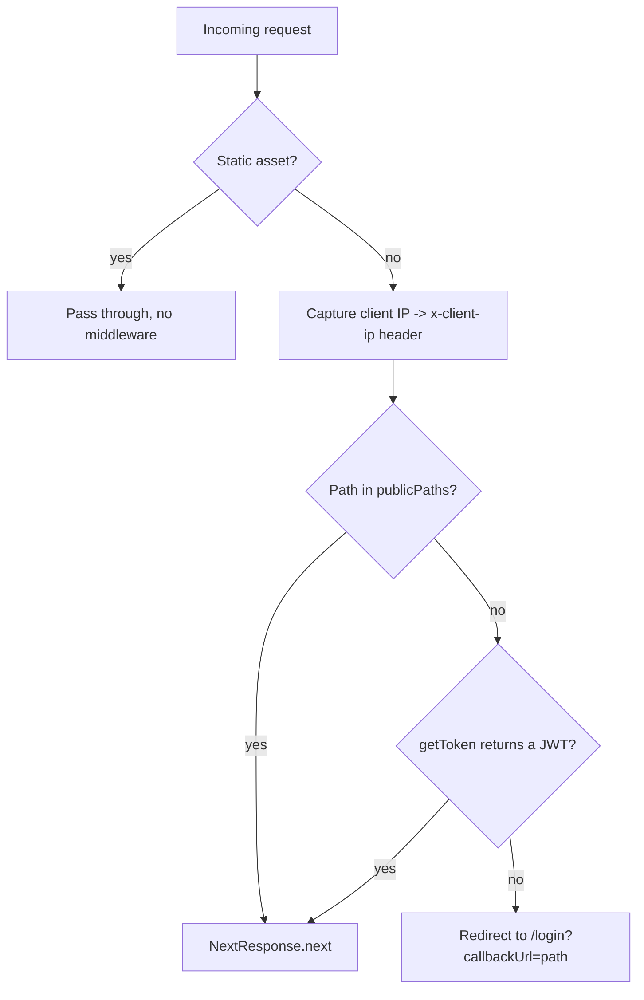

# Frontend Architecture

How the Attendance Next.js 15 App Router frontend is wired: routing, layouts, authentication,
request transport, data fetching, and theming.

## 1. App Router structure

```
src/app/
├── layout.tsx                 # Root layout (RTL, providers, theming, Toaster)
├── globals.css / theme.css    # Tailwind v4 + theme tokens
├── (auth)/                    # PUBLIC route group
│   ├── login/page.tsx         # Credentials login (signIn)
│   └── unauthorized/          # Access-denied page
├── (routes)/                  # PROTECTED route group
│   ├── layout.tsx             # Authenticated shell: KBar + Sidebar + Header
│   ├── dashboard/
│   ├── attendance/  employee/  schedule/  leave/  reports/
│   ├── organizational-unit/   system/   profile/
└── api/
    ├── auth/[...nextauth]/route.ts   # NextAuth handler (GET/POST)
    ├── client-ip/                    # Returns caller IP (used for X-Client-IP)
    └── health/
```

Route **groups** `(auth)` and `(routes)` do not affect the URL — they exist to attach different
layouts. `(auth)` pages render bare (no sidebar); `(routes)` pages render inside the authenticated
dashboard shell. Within each feature area, `page.tsx` files are thin shells that render a component
from `src/features/<feature>/components`.

## 2. Layouts

### Root layout — `src/app/layout.tsx`
- Sets `<html lang="en" dir="rtl">` — the whole app is **right-to-left / Arabic**.
- Wraps children in (outer → inner): `NuqsAdapter` → `ThemeProvider` → `QueryClientProvider` →
  `ThemeProvider` → `Providers` (which contains `AuthProvider` + `ActiveThemeProvider`).
- Renders the global `<Toaster />` (sonner) and `NextTopLoader`.
- Reads the `active_theme` cookie to apply a `theme-<value>` class on `<body>` (server-rendered, no
  flash).

### Protected layout — `src/app/(routes)/layout.tsx`
- Title: `منصة أدارة الموقف اليومي`.
- Renders `KBar` (Cmd-K) → `SidebarProvider` → `AppSidebar` (right side) + `SidebarInset`
  (`Header` + page content).
- Persists sidebar open/closed via the `sidebar:state` cookie.
- The sidebar (`src/components/layout/app-sidebar.tsx`) filters nav items by the current user's role
  — see [system-admin.md](./system-admin.md).

## 3. Authentication (NextAuth)

### Config — `src/lib/auth-option.ts`
- **Credentials provider** with fields `userLogin` + `password`.
- `authorize()` POSTs to the backend **`/auth/login`** through `fetchAuth.post` (see
  `src/lib/fetch-client.ts`). On `{ isSuccess: true, data: { userId, token } }` it returns a user
  object carrying `accessToken: data.token`.
- **Session strategy `jwt`, `maxAge` = 8 hours.**
- `jwt` callback: on login, copies `accessToken` and `roles` into the token and stamps
  `accessTokenExpires = now + 8h`. On later calls it returns the existing token until expiry, then
  sets `error: "RefreshAccessTokenError"` (no refresh flow — the user must re-login).
- `session` callback: exposes `session.accessToken`, `session.roles`, `session.error`, and
  `session.user` (id/name/email/roles) to the app.
- Custom pages: `signIn: '/login'`, `error: '/error'`, `signOut: '/signout'`.

### Handler — `src/app/api/auth/[...nextauth]/route.ts`
Standard `NextAuth(authOption)` exported as both `GET` and `POST`.

### fetch-client — `src/lib/fetch-client.ts`
A thin `fetch` wrapper used by NextAuth's `authorize()`. `fetchClient` builds the full URL from
`NEXT_PUBLIC_API_URL`, attaches the bearer (browser side, via `getSession`), and parses JSON.
`fetchAuth.get/post` are the convenience methods.

### Login sequence

```mermaid
sequenceDiagram
    participant B as Browser (/login page)
    participant NA as NextAuth (route handler)
    participant AZ as authorize() (auth-option.ts)
    participant FC as fetchAuth (fetch-client.ts)
    participant API as .NET API (/auth/login)

    B->>NA: signIn('credentials', { userLogin, password })
    NA->>AZ: authorize(credentials)
    AZ->>FC: fetchAuth.post('/auth/login', {userLogin, password})
    FC->>API: POST {NEXT_PUBLIC_API_URL}/auth/login
    API-->>FC: { isSuccess, data: { userId, token } }
    FC-->>AZ: parsed JSON
    AZ-->>NA: user { id, accessToken: token, roles }
    NA->>NA: jwt callback → store accessToken + 8h expiry in JWT
    NA-->>B: Set session cookie; client redirects to /dashboard
    Note over B,API: Later requests
    B->>API: GET /... with Authorization: Bearer <session.accessToken>
```

The login page (`src/app/(auth)/login/page.tsx`) is a client component: it calls `signIn`, watches
`useSession`, and on `authenticated` redirects to `/dashboard`.

## 4. Middleware route guard — `src/middleware.ts`

Runs on every request except static assets (`matcher` excludes `_next/static`, `_next/image`,
`favicon.ico`, `public`). Two jobs:

1. **Client IP capture** — extracts the IP from `x-forwarded-for` / `x-real-ip` /
   `cf-connecting-ip` / `x-vercel-forwarded-for` and forwards it as the `x-client-ip` request
   header so Server Components / axios can read it.
2. **Auth gate** — paths in `publicPaths` (`/`, `/login`, `/signout`, `/auth/error`, `/api/auth`,
   `/api/client-ip`) pass through. For anything else it calls `getToken({ req, secret })`; if there
   is **no token** it redirects to `/login?callbackUrl=<path>`.



## 5. Request transport — `src/lib/axios.ts`

Two axios instances share `baseURL = NEXT_PUBLIC_API_URL`, JSON headers, and a 10s timeout.

### `axiosInstance` — server-side
- **Request interceptor**: calls `getServerSession(authOption)` on every request and, if present,
  sets `Authorization: Bearer <session.accessToken>`. Resolves the client IP (first from the
  `x-client-ip` header via `next/headers`, else via the `/api/client-ip` route) and sets the
  **`X-Client-IP`** header.
- **Response interceptor (server)**: on error it does **not throw** — for GET/list endpoints it
  resolves a safe fallback (`data: []` for lists, `data: null` for single items) with status 200.
  This keeps Server Components from crashing when the backend is unreachable (e.g. the unreachable
  MSSQL noted in the root `CLAUDE.md`). Used by the async Server-Component "listing" components.

### `axiosClient` — client-side
- Token is **not** read from the session automatically; components call `setAuthToken(token)` to set
  `Authorization` on `axiosClient.defaults`. The request interceptor only adds `X-Client-IP` (from
  `/api/client-ip`, cached in `localStorage`).
- **Response interceptor (client)**: logs and **re-throws** so components / mutations can handle
  errors (401 → re-auth hint, 5xx → service-unavailable hint). Used by forms, dialogs, and
  React-Query mutations (the `…Client` service variants).

> Rule of thumb: **server reads → `axiosInstance`** (auto-token, swallow errors); **client writes /
> interactive reads → `axiosClient`** (explicit token, throw errors).

## 6. Data fetching — React Query

`src/providers/query-client-provider.tsx` wraps the app in a single `QueryClient`. React Query is
used mainly for client-side reads/mutations — e.g. `src/hooks/use-current-user.ts` (`useQuery`
keyed `['currentUser']`, `useMutation` to refresh) calls `currentUserService.getCurrentUserClient()`
through a `useAuthApi` wrapper. Server-Component listings fetch directly with the service's
`axiosInstance` variants rather than React Query.

## 7. Theming

- `ThemeProvider` (next-themes via `src/lib/theme-provider`) with `attribute="class"`,
  `defaultTheme="system"`, `enableSystem`.
- An `ActiveThemeProvider` (`src/components/active-theme`) plus the `active_theme` cookie drive named
  color themes / scaled density (`theme-<value>` / `theme-scaled` on `<body>`).
- Tailwind v4 tokens live in `globals.css` + `theme.css`.

## 8. Why one `NEXT_PUBLIC_API_URL` (host vs container)

NextAuth's server-side `authorize()` reaches the backend through `fetchAuth` → `fetch-client.ts`,
which uses **`NEXT_PUBLIC_API_URL`** — the *same* variable browser-side calls use. In a container
these would need different hosts: `host.docker.internal:7080` for server-side vs `localhost:7080`
for the browser (which cannot resolve `host.docker.internal`). Running the **frontend on the host**
makes a single `localhost:7080` correct for both server and browser, with no code edits or
`/etc/hosts` changes. (To containerize later, change the `authorize` call to use a server-only
`API_URL` instead of `NEXT_PUBLIC_API_URL`.) This is why the documented local topology runs backend
+ infra in Docker but the frontend with `npm run dev` on the host.

## Source map

| Concern | File |
|---|---|
| Root layout / providers / RTL | `src/app/layout.tsx`, `src/components/layout/providers.tsx` |
| Protected shell | `src/app/(routes)/layout.tsx`, `src/components/layout/app-sidebar.tsx`, `src/components/layout/header.tsx` |
| Login page | `src/app/(auth)/login/page.tsx` |
| NextAuth config | `src/lib/auth-option.ts` |
| NextAuth handler | `src/app/api/auth/[...nextauth]/route.ts` |
| Auth fetch client | `src/lib/fetch-client.ts` |
| Middleware (guard + IP) | `src/middleware.ts` |
| Client-IP route | `src/app/api/client-ip/route.ts` |
| Axios instances | `src/lib/axios.ts` |
| React Query provider | `src/providers/query-client-provider.tsx` |
| Current-user hook | `src/hooks/use-current-user.ts` |
| Nav items + roles | `src/constants/data.ts` |
