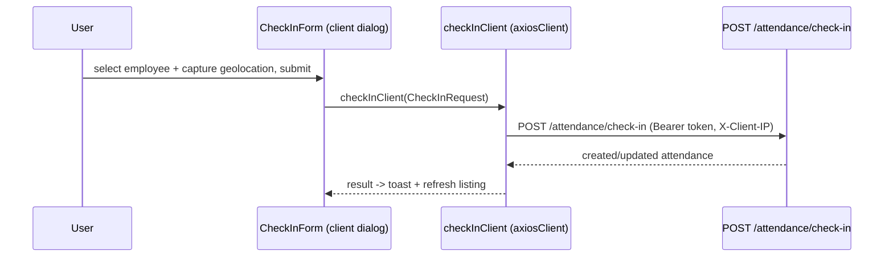

# Attendance & Attendance Logs

## 1. Purpose

The attendance area is the operational core of the platform. It covers two related features:

- **`features/attendance`** — the attendance *records* (a day's presence/status per employee):
  list all attendance, see who has **not** clocked in ("not-attendance"), perform **check-in /
  check-out**, and **approve** records. Records carry a status (Present, Absent, Late, Overtime,
  Vacation, …).
- **`features/attendance-logs`** — the raw **punch logs** (individual IN/OUT events from devices,
  mobile, web, RFID/NFC/QR cards, manual entry). One attendance record is derived from one or more
  logs.

## 2. Routes & key components

All routes are under `src/app/(routes)/attendance/`.

| Route | Page file | Renders | Feature folder |
|---|---|---|---|
| `/attendance/view-all-attendance` | `view-all-attendance/page.tsx` | `AttendanceListing` (Suspense) | `features/attendance` |
| `/attendance/view-all-attendance/new` | `view-all-attendance/new/page.tsx` | `AttendanceForm` (initialData=null) | `features/attendance` |
| `/attendance/view-all-attendance/[id]` | `[id]/page.tsx` | `AttendanceViewPage` | `features/attendance` |
| `/attendance/view-all-attendance/[id]/edit` | `[id]/edit/page.tsx` | `AttendanceForm` | `features/attendance` |
| `/attendance/not-attendance` | `not-attendance/page.tsx` | `NotAttendanceListing` (Suspense) | `features/attendance` |
| `/attendance/attendance-logs` | `attendance-logs/page.tsx` | `AttendanceLogsListing` (Suspense) | `features/attendance-logs` |
| `/attendance/attendance-logs/[id]` | `attendance-logs/[id]/page.tsx` | `AttendanceLogsViewPage` | `features/attendance-logs` |
| `/attendance/manual-corrections` | `manual-corrections/page.tsx` | placeholder stub | — |
| `/attendance/approvereject-records` | `approvereject-records/page.tsx` | placeholder stub | — |

Sidebar exposes only **View All Attendance**, **Not Attendance**, and **Attendance Logs** (see
`src/constants/data.ts`); `manual-corrections` and `approvereject-records` are unfinished stubs.

### Key components (`features/attendance/components`)

| File | Purpose |
|---|---|
| `attendance-listing.tsx` | Async Server Component; fetches the list (`getAttendanceList`) using filters from search params (page, searchTerm, date, status, organizationId) and renders the table |
| `attendance-tables/{index,columns,cell-action}.tsx` | TanStack Table; pagination via `nuqs`; row actions (view/edit/delete) |
| `check-in-form.tsx` | Client dialog: employee select + geolocation; calls `checkInClient` |
| `check-out-form.tsx` | Client dialog: employee select + geolocation; calls `checkOutClient` |
| `attendance-actions.tsx` | Toolbar buttons that open the check-in dialog |
| `attendance-form.tsx` | Create/edit a record; calls `updateAttendance` (and create) |
| `attendance-view.tsx` | Read-only detail view; hosts the approve dialog |
| `attendnce-approve.tsx` | Approve dialog; calls `approveAttendanceClient` |
| `not-attendance-listing.tsx` + `not-attendance-tables/*` | Server-fetched list of employees with no attendance (`getNotAttendance`) |

### Key components (`features/attendance-logs/components`)

| File | Purpose |
|---|---|
| `attendance-logs-listing.tsx` | Server Component; fetches logs (`getAttendanceLogsList`) with filters (page, pageSize, organizationId, searchTerm, startDate, endDate, direct, attendanceStatus) |
| `attendance-logs-tables/{index,columns,cell-action}.tsx` | TanStack Table for logs |
| `attendance-logs-view-page.tsx` | Card-based detail: employee, org unit, attendance, card, device info |

## 3. Data flow

Services live in `features/attendance/api/attendance.service.ts` and
`features/attendance-logs/api/attendance-logs.service.ts`. Each function exists in a **server**
variant (`axiosInstance`) and a **client** variant (`…Client`, `axiosClient`). Listing components
(Server Components) use the server variants; dialogs/forms use the client variants. Backend base is
`NEXT_PUBLIC_API_URL`.

### Backend endpoints — attendance

| Service function (server / `…Client`) | Method | Endpoint |
|---|---|---|
| `getAttendanceList` | GET | `/attendance` |
| `getAttendanceById` | GET | `/attendance/{id}` |
| `createAttendance` | POST | `/attendance` |
| `updateAttendance` | PUT | `/attendance/{id}` |
| `deleteAttendance` | DELETE | `/attendance/{id}` |
| `checkIn` | POST | `/attendance/check-in` |
| `checkOut` | POST | `/attendance/check-out` |
| `approveAttendance` | POST | `/attendance/{id}/approve` |
| `getNotAttendance` | GET | `/attendance/not-attendance` |

### Backend endpoints — attendance-logs

| Service function (server / `…Client`) | Method | Endpoint |
|---|---|---|
| `getAttendanceLogsList` | GET | `/attendance-logs` |
| `getAttendanceLogById` | GET | `/attendance-logs/{id}` |
| `createAttendanceLog` | POST | `/attendance-logs` |
| `updateAttendanceLog` | PUT | `/attendance-logs/{id}` |
| `deleteAttendanceLog` | DELETE | `/attendance-logs/{id}` |

### Types

- `features/attendance/types/attendance.ts` — enums `AttendanceStatus` (Present, Absent, Break,
  Vacation, Holiday, Late, Early_Out, Overtime, Shift_Change, Shift_Swap, …, Completed) and
  `LogMethod` (Mobile_App, Web, Biometric, RFID_Card, NFC_Card, QR_Card, Manual_Entry, API); DTOs
  `CheckInRequest`, `CheckOutRequest`, `ApproveAttendanceRequest`, `AttendanceQuery`,
  `NotAttendanceQuery`, etc.
- `features/attendance-logs/types/attendance-logs.ts` — enum `Direct` (IN=1, OUT=2), `AttendanceLogResponse`,
  `AttendanceLogQuery`, paginated wrappers.

## 4. Flows

### List view (server-rendered)

```mermaid
graph LR
    A[/attendance/view-all-attendance] --> B[AttendanceListing - Server Component]
    B --> C[getAttendanceList via axiosInstance]
    C --> D[GET /attendance with filter params]
    D --> E[AttendanceTable - Client]
    E -. nuqs page/filter change .-> A
```

### Check-in



## 5. Source map

```
src/features/attendance/
  api/attendance.service.ts
  types/{attendance.ts,index.ts}
  components/
    attendance-listing.tsx        attendance-tables/{index,columns,cell-action}.tsx
    check-in-form.tsx             check-out-form.tsx
    attendance-form.tsx           attendance-view.tsx
    attendnce-approve.tsx         attendance-actions.tsx
    not-attendance-listing.tsx    not-attendance-tables/{index,columns,cell-action}.tsx

src/features/attendance-logs/
  api/attendance-logs.service.ts
  types/{attendance-logs.ts,index.ts}
  components/
    attendance-logs-listing.tsx   attendance-logs-tables/{index,columns,cell-action}.tsx
    attendance-logs-view-page.tsx

src/app/(routes)/attendance/
  view-all-attendance/{page.tsx, new/page.tsx, [id]/page.tsx, [id]/edit/page.tsx}
  not-attendance/page.tsx
  attendance-logs/{page.tsx, [id]/page.tsx}
  manual-corrections/page.tsx     approvereject-records/page.tsx   (stubs)
```
