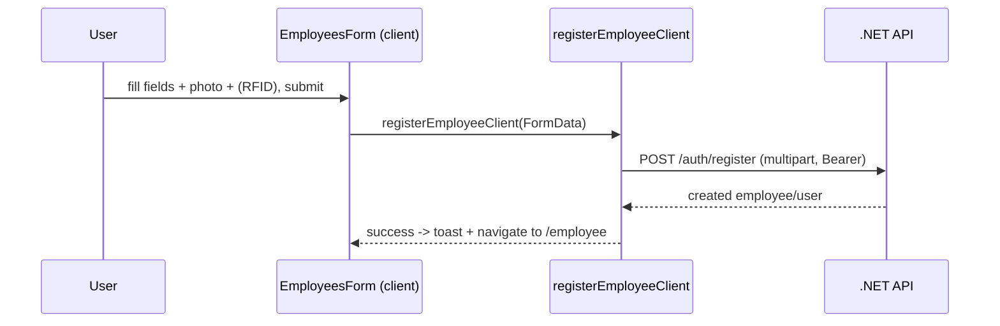

# Employees

## 1. Purpose

`features/employee` manages people. It lists employees with pagination/search, registers new
employees (with photo upload + optional RFID card), edits them, assigns managers, manages roles and
status, and provides the profile/change-password backing functions reused by the profile area.
Registering an employee is effectively user registration on the backend (`/auth/register`).

## 2. Routes & key components

Routes under `src/app/(routes)/employee/`.

| Route | Page file | Renders | Notes |
|---|---|---|---|
| `/employee` | `page.tsx` | `EmployeesListing` | paginated employee list |
| `/employee/[id]` | `[id]/page.tsx` | `EmployeeViewPage` | single employee detail |
| `/employee/addedit-employees` | `addedit-employees/page.tsx` | add/edit form (`employees-form.tsx`) | |
| `/employee/addedit-employees/new` | `addedit-employees/new/page.tsx` | `EmployeesForm` (new) | registration |
| `/employee/addedit-employees/[id]` (+ `/edit`) | `addedit-employees/[id]/…` | `EmployeesForm` (edit) | |
| `/employee/assign-managers` (+ `new`, `[id]`, `[id]/edit`) | `assign-managers/…` | placeholder pages | `assign-managers-form.tsx` exists but not yet wired |
| `/employee/employee-schedules` (+ `new`, `[id]`, `[id]/edit`) | `employee-schedules/…` | placeholder pages | `employee-schedules-form.tsx` exists but not yet wired |

Sidebar exposes **Employee** (`/employee`) and **Add/Edit Employees**
(`/employee/addedit-employees`). The assign-managers and employee-schedules forms are built but
their routes currently render "no data" placeholder cards.

### Key components (`features/employee/components`)

| File | Purpose |
|---|---|
| `employees-listing.tsx` | Server Component; fetches list (`getEmployees`) with filters, renders the table |
| `employees-form.tsx` | Register/edit employee (React Hook Form + Zod); multipart upload for photo; RFID field |
| `employees-view-page.tsx` | Listing view with tabs (overview/contact/manager) |
| `employee-view-page.tsx` | Single-employee detail/profile view |
| `assign-managers-form.tsx` | Assign a manager to an employee (`assignManager`) |
| `employee-schedules-form.tsx` | Create/edit an employee work schedule |
| `employee-tables/{index,columns,cell-action}.tsx` | TanStack Table for employees |
| `employee-schedules-tables/{index,data-table,columns}.tsx` | Table for employee schedules |

## 3. Data flow

Service: `features/employee/api/employees.service.ts`. Server variants use `axiosInstance`;
`…Client` variants use `axiosClient`. No React Query wrapper — services are called directly from
Server Components (lists) and from forms (mutations). `registerEmployee` sends
`multipart/form-data` (photo upload).

### Backend endpoints

| Function (server / `…Client`) | Method | Endpoint |
|---|---|---|
| `registerEmployee` | POST | `/auth/register` (multipart) |
| `getEmployees` | GET | `/employees?{query}` |
| `getEmployeeById` | GET | `/employees/{id}` |
| `updateEmployee` | PUT | `/employees/{id}` |
| `deleteEmployee` | DELETE | `/employees/{id}` |
| `getProfile` | GET | `/employees/profile` |
| `updateProfile` | PUT | `/employees/profile` |
| `changePassword` | POST | `/employees/change-password` |
| `updateRole` | PUT | `/employees/{id}/role` |
| `assignManager` | PUT | `/employees/{id}/manager` |
| `getOrganizationalUnits` | GET | `/organizational-units` |
| `getManagers` | GET | `/employees?isManager=true&pageSize=100` |

### Types (`features/employee/types/employees.ts`)

`EmployeeData`, `EmployeeRegistrationRequest`/`Response`, `EmployeeUpdateRequest`,
`ProfileResponse`/`ProfileUpdateRequest`, `ChangePasswordRequest`, `UpdateRoleRequest`,
`AssignManagerRequest`, `OrganizationalUnit`, `Manager`, `PaginatedResponse<T>`, and enums
`Role` (Admin/Manager/Employee) and `UserStatus` (Active/Inactive/Suspended/Terminated).

## 4. Flows

### Register an employee



### List + edit

```mermaid
graph LR
    A[/employee] --> B[EmployeesListing - Server]
    B --> C[getEmployees -> GET /employees]
    C --> D[Employee table - Client]
    D -->|row action: edit| E[/employee/addedit-employees/[id]]
    E --> F[EmployeesForm -> PUT /employees/[id]]
```

## 5. Source map

```
src/features/employee/
  api/employees.service.ts
  types/employees.ts
  components/
    employees-listing.tsx     employees-form.tsx
    employees-view-page.tsx   employee-view-page.tsx
    assign-managers-form.tsx  employee-schedules-form.tsx
    employee-tables/{index,columns,cell-action}.tsx
    employee-schedules-tables/{index,data-table,columns}.tsx

src/app/(routes)/employee/
  page.tsx   [id]/page.tsx
  addedit-employees/{page.tsx, new/page.tsx, [id]/page.tsx, [id]/edit/page.tsx}
  assign-managers/{...}      (placeholder)
  employee-schedules/{...}   (placeholder)
```
