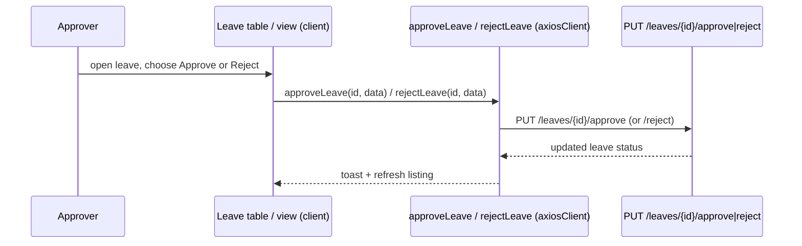

# Leave

## 1. Purpose

`features/leave` (إدارة المواقف — "situation/leave management") handles employee leave requests:
list/filter leaves, create a new leave, view a leave's detail, and **approve / reject / cancel**
requests. Many leave types are supported (ordinary, sick, emergency, maternity, Hajj, Umrah, study,
unpaid, etc.).

## 2. Routes & key components

Routes under `src/app/(routes)/leave/`. The sidebar links a single top-level **Leave Management**
entry at `/leave`.

| Route | Page file | Renders |
|---|---|---|
| `/leave` | `page.tsx` | `LeaveListing` |
| `/leave/new` | `new/page.tsx` | `LeaveForm` (title "إضافة موقف جديد") |
| `/leave/[id]` | `[id]/page.tsx` | `LeaveViewPage` |

### Components (`features/leave/components`)

| File | Purpose |
|---|---|
| `leave-listing.tsx` | Server Component; fetches + renders the leave table with pagination/filter |
| `leave-form.tsx` | Create/edit a leave request (React Hook Form + Zod) |
| `leave-view-page.tsx` | Client detail view of a single leave |
| `leave-tables/{index,columns,cell-action}.tsx` | TanStack Table; row actions include view/edit/delete and approve/reject |

## 3. Data flow

Service: `features/leave/api/approvereject-leaves.service.ts`. Reads use `axiosInstance`; write
operations (create/update/delete and approve/reject/cancel) use `axiosClient`. Base
`NEXT_PUBLIC_API_URL`.

### Backend endpoints — base `/leaves`

| Function | Method | Endpoint |
|---|---|---|
| `getLeaves` | GET | `/leaves` |
| `getLeaveById` | GET | `/leaves/{id}` |
| `createLeave` | POST | `/leaves` |
| `updateLeave` | PUT | `/leaves/{id}` |
| `deleteLeave` | DELETE | `/leaves/{id}` |
| `approveLeave` | PUT | `/leaves/{id}/approve` |
| `rejectLeave` | PUT | `/leaves/{id}/reject` |
| `cancelLeave` | PUT | `/leaves/{id}/cancel` |

### Types (`features/leave/types/leaves.ts`)

`LeaveResponse` (paginated), `LeaveItem`, `LeaveFilter`, enum `LeaveType` (Ordinary, Sick,
Emergency, Maternity, TimeOff, Hajj, Umrah, Study, Unpaid, Compensatory, Duty, Night_Break,
Permitted, Cycle, Workshop) and `LeaveTypeDisplay` (Arabic labels).

## 4. Flow



## 5. Source map

```
src/features/leave/
  api/approvereject-leaves.service.ts
  types/leaves.ts
  components/
    leave-listing.tsx  leave-form.tsx  leave-view-page.tsx
    leave-tables/{index,columns,cell-action}.tsx

src/app/(routes)/leave/
  page.tsx  new/page.tsx  [id]/page.tsx
```
