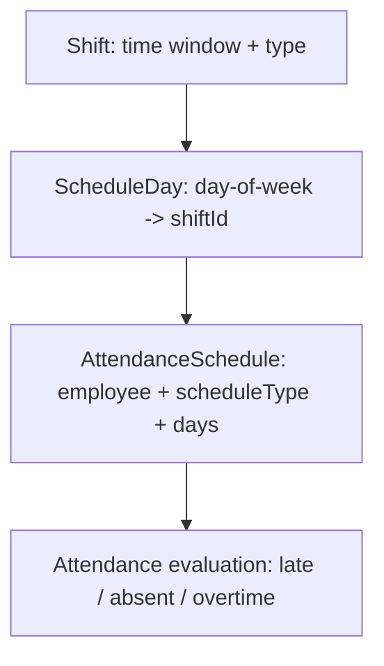
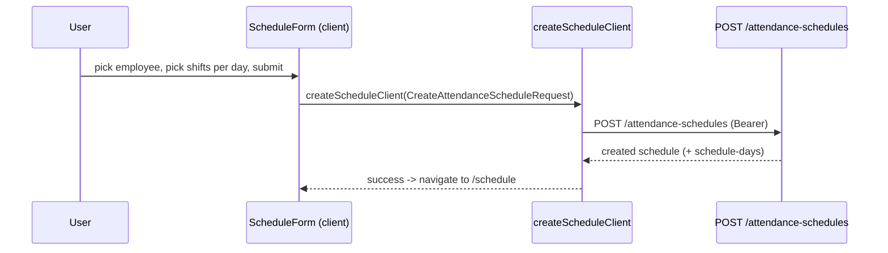

# Schedules & Shifts

## 1. Purpose

Two complementary features define *when* employees are expected to work:

- **`features/shift`** — reusable **shift** definitions (a named time window with type, e.g. Morning
  07:00–15:00). Shifts are the building blocks.
- **`features/schedule`** — **attendance schedules** that assign shifts to employees per day of
  week (the schedule's "schedule-days"). Supports schedule types (Regular, Flexible, Custom,
  Rotating, PartTime, FullTime), viewing "my schedules", and bulk assignment.

Attendance evaluation (late/absent/overtime) is driven by the employee's schedule + shift.

## 2. Routes & key components

Routes under `src/app/(routes)/schedule/`.

| Route | Page file | Renders | Feature |
|---|---|---|---|
| `/schedule` | `page.tsx` | `ScheduleListing` | schedule |
| `/schedule/create-schedule` | `create-schedule/page.tsx` | `ScheduleForm` (new) | schedule |
| `/schedule/[id]` | `[id]/page.tsx` | `ScheduleForm` (edit) | schedule |
| `/schedule/[id]/view` | `[id]/view/page.tsx` | `ScheduleView` | schedule |
| `/schedule/[id]/update-days` | `[id]/update-days/page.tsx` | `ScheduleUpdateDaysForm` | schedule |
| `/schedule/assign-schedules` | `assign-schedules/page.tsx` | `AssignSchedules` (stub UI) | schedule |
| `/schedule/shifts` | `shifts/page.tsx` | `ShiftsListing` | shift |
| `/schedule/shifts/new` | `shifts/new/page.tsx` | `ShiftForm` (new) | shift |
| `/schedule/shifts/[id]` | `shifts/[id]/page.tsx` | `ShiftView` | shift |
| `/schedule/shifts/[id]/edit` | `shifts/[id]/edit/page.tsx` | `ShiftForm` (edit) | shift |

Sidebar exposes **Create Schedules** (`/schedule`) and **Shifts** (`/schedule/shifts`). The
`assign-schedules`, `schedule-templates`, and `schedule-reports` nav entries are commented out in
`src/constants/data.ts` (templates/reports routes are not wired).

### Schedule components (`features/schedule/components`)

| Component | Purpose |
|---|---|
| `ScheduleListing` | Server Component; paginated schedule table |
| `ScheduleForm` | Create/edit schedule (employee + shift selection) |
| `ScheduleView` | Read-only schedule detail |
| `ScheduleTable` | TanStack Table wrapper (columns + cell actions) |
| `ScheduleDaysForm` / `ScheduleUpdateDaysForm` | Manage per-day-of-week shift assignments |
| `AssignSchedules` | Bulk-assign schedules to multiple employees |

### Shift components (`features/shift/components`)

| Component | Purpose |
|---|---|
| `ShiftsListing` | Server Component; paginated shift table |
| `ShiftForm` | Create/edit shift (time window, type, settings) |
| `ShiftView` | Read-only shift detail |
| `ShiftTable` | TanStack Table wrapper |

## 3. Data flow

Services: `features/schedule/api/schedule.service.ts` and `features/shift/api/shift.service.ts`.
Both expose server (`axiosInstance`) + `…Client` (`axiosClient`) variants. DELETE expects HTTP 204.

### Schedule endpoints — base `/attendance-schedules`

| Function (server / `…Client`) | Method | Endpoint |
|---|---|---|
| `getSchedulesList` | GET | `/attendance-schedules` |
| `getScheduleById` | GET | `/attendance-schedules/{id}` |
| `createSchedule` | POST | `/attendance-schedules` |
| `updateSchedule` | PUT | `/attendance-schedules/{id}` |
| `deleteSchedule` | DELETE | `/attendance-schedules/{id}` |
| `getMySchedules` | GET | `/attendance-schedules/my-schedules` |
| `updateScheduleDays` | PUT | `/attendance-schedules/{id}/schedule-days` |

### Shift endpoints — base `/shifts`

| Function (server / `…Client`) | Method | Endpoint |
|---|---|---|
| `getShiftsList` | GET | `/shifts` |
| `getShiftById` | GET | `/shifts/{id}` |
| `createShift` | POST | `/shifts` |
| `updateShift` | PUT | `/shifts/{id}` |
| `deleteShift` | DELETE | `/shifts/{id}` |

### Types

- `features/schedule/types/schedules.ts` — `AttendanceScheduleResponse`,
  `CreateAttendanceScheduleRequest`, `UpdateAttendanceScheduleRequest`, `UpdateScheduleDaysRequest`,
  `AttendanceScheduleQuery`, `MySchedulesQuery`, `ScheduleDay*`, enum `ScheduleType`.
- `features/shift/types/shift.ts` — `ShiftData`, `ShiftResponse`, `CreateShiftRequest`,
  `UpdateShiftRequest`, `ShiftQuery`, enum `ShiftType`.

## 4. Flows

### Schedule → shift relationship



### Create schedule



## 5. Source map

```
src/features/schedule/
  api/schedule.service.ts   types/schedules.ts
  components/ (ScheduleListing, ScheduleForm, ScheduleView, ScheduleTable,
               ScheduleDaysForm, ScheduleUpdateDaysForm, AssignSchedules)

src/features/shift/
  api/shift.service.ts      types/shift.ts
  components/ (ShiftsListing, ShiftForm, ShiftView, ShiftTable)

src/app/(routes)/schedule/
  page.tsx  create-schedule/page.tsx
  [id]/{page.tsx, view/page.tsx, update-days/page.tsx}
  assign-schedules/page.tsx
  shifts/{page.tsx, new/page.tsx, [id]/page.tsx, [id]/edit/page.tsx}
```
