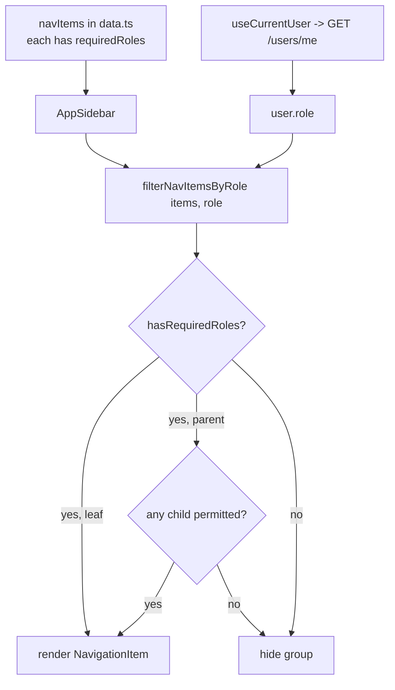

# System Administration

## 1. Purpose

`features/system` is the admin area (إعدادات النظام — "System Settings"), gated to **Admin** only in
the sidebar. It groups five sub-features:

- **users-permissions** — manage users, roles, status, passwords.
- **devices** — attendance/punch device registry.
- **organizationsunits** — organizational unit management (reuses the `features/organizational-unit`
  feature; the canonical org-unit feature also lives at `/organizational-unit`).
- **work-locations** — physical work locations.
- **system-configuration** — system-wide settings.

> Implementation status: `users-permissions` and `devices` are fully wired. `work-locations`,
> `system-configuration`, and the `system/organizationsunits` service files are present but their
> `api/*.service.ts` are empty stubs / placeholder pages; org-unit CRUD actually runs through
> `features/organizational-unit`.

## 2. Routes & key components

Each sub-feature follows the `listing → new → [id] → [id]/edit` route pattern under
`src/app/(routes)/system/<sub>/` (org units also at `src/app/(routes)/organizational-unit/`).

| Route | Renders |
|---|---|
| `/system/users-permissions` (+ new, [id], [id]/edit) | `UsersPermissionsListing` / `UsersPermissionsForm` |
| `/system/devices` (+ new, [id], [id]/edit) | `DevicesListing` / `DevicesForm` |
| `/system/organizationsunits` (+ …) | `OrganizationalUnitListing` (from `features/organizational-unit`) |
| `/organizational-unit` (+ new, [id], [id]/edit) | `OrganizationalUnitListing` |
| `/system/work-locations` (+ …) | placeholder |
| `/system/system-configuration` (+ …) | placeholder |

Sidebar (Admin-only) exposes **Users & Permissions** (`/system/users-permissions`),
**Organizations/Units** (`/organizational-unit`), and **Devices** (`/system/devices`).

### Key components

- **users-permissions/**: `users-permissions-listing.tsx`, `users-permissions-form.tsx`,
  `users-permissions-view-page.tsx`, `users-permissions-tables/{columns,data-table,row-actions}`,
  `change-password-dialog.tsx`, `reset-password-dialog.tsx`, `password-actions.tsx`.
- **devices/**: `devices-listing.tsx`, `devices-form.tsx`, `devices-view-page.tsx`,
  `devices-tables/{columns,index,cell-action}`.
- **organizationsunits/** + **organizational-unit/**: `*-listing.tsx`, `*-form.tsx`,
  `*-view-page.tsx`, `*-tables/*`.

## 3. Data flow

### users-permissions — `features/system/users-permissions/api/users-permissions.service.ts`

Server (`axiosInstance`) + `…Client` (`axiosClient`) variants. Note the endpoint base differs
between some server and client variants (`/users` vs `/users-permissions`).

| Function | Method | Endpoint |
|---|---|---|
| `getUsersPermissionsList` | GET | `/users` (client: `/users-permissions`) |
| `getUserPermissionById` | GET | `/users/{id}` (client: `/users-permissions/{id}`) |
| `createUser` / `createUserClient` | POST | `/users-permissions` (client: `/users/new`) |
| `updateUserRole` | PUT | `/users-permissions/{id}/role` |
| `updateUserClient` | PUT | `/users/{id}` |
| `deleteUser` | DELETE | `/users-permissions/{id}` |
| `getCurrentUser` | GET | `/users/me` (client: `/users-permissions/me`) |
| `changePassword` | PUT/POST | `/users-permissions/change-password` (client: `/users/change-password`) |
| `resetPassword` | PUT/POST | `/users/reset-password` |
| `toggleUserStatus` | PUT | `/users-permissions/{id}/toggle-status` |

### devices — `features/system/devices/api/devices.service.ts`

| Function | Method | Endpoint |
|---|---|---|
| `getDevicesList` | GET | `/devices` |
| `getDeviceById` | GET | `/devices/{id}` |
| `createDevice` | POST | `/devices` |
| `updateDevice` | PUT | `/devices/{id}` |
| `deleteDevice` | DELETE | `/devices/{id}` |

### organizational units — `features/organizational-unit/api/organizational.service.ts`

| Function | Method | Endpoint |
|---|---|---|
| `getOrganizationalUnits` | GET | `/organizational-units` |
| `getOrganizationalUnitById` | GET | `/organizational-units/{id}` |
| `getOrganizationalUnitTree` | GET | `/organizational-units/tree` |
| `createOrganizationalUnit` | POST | `/organizational-units` |
| `updateOrganizationalUnit` | PUT | `/organizational-units/{id}` |
| `deleteOrganizationalUnit` | DELETE | `/organizational-units/{id}` |
| `getOrganizationalUnitListById` / `updateOrganizationalUnitStatus` | GET/PATCH | legacy `OrganizationalUnit/*`, `ChangeStatus/ChangeStatus` |

`system/work-locations`, `system/system-configuration`, and `system/organizationsunits` service
files are empty (0 bytes).

## 4. Role-Based Access Control (RBAC)

Source of truth: `features/system/users-permissions/types/users-permissions.ts` defines the `Role`
enum (see `ROLE_BASED_ACCESS_CONTROL.md` in the frontend root):

| Role | Value | Role | Value |
|---|---|---|---|
| `Admin` | 1 | `Viewer` | 7 |
| `User` | 2 | `SuperAdmin` | 8 |
| `Manager` | 3 | `SystemUser` | 9 |
| `Employee` | 4 | `SystemManager` | 10 |
| `Guest` | 5 | | |
| `HR_Manager` | 6 | | |

### How navigation is filtered by role

1. **Declarative metadata** — `src/constants/data.ts` declares `navItems: NavItem[]`. Each item
   (and sub-item) may carry `requiredRoles: Role[]`. Examples:
   - Dashboard / Attendance / Employee / Schedule / Leave / Reports → `[Admin, Manager, Employee]`.
   - "Reports & Analytics" group → `[Admin, Manager]`.
   - "System Settings" group → `[Admin]` only.

2. **Filtering at render** — `src/components/layout/app-sidebar.tsx`:
   - `useCurrentUser()` (React Query, keyed `['currentUser']`, via
     `currentUserService.getCurrentUserClient()` → `GET /users(-permissions)/me`) provides the
     current user's role.
   - `hasRequiredRoles(userRole, requiredRoles)` returns `true` if `requiredRoles` is empty or
     includes the user's role.
   - `filterNavItemsByRole(items, userRole)` keeps items the user may access; for items with
     children it keeps the parent only if at least one child is permitted, and recurses into
     children. Memoized with `useMemo`; `NavigationItem` is `React.memo`'d; a `Suspense` +
     `SidebarLoadingFallback` covers the loading state.



> Note: `auth-option.ts` currently hardcodes the session roles to `[{ name: 'User' }]`; the
> authoritative role for nav filtering comes from `useCurrentUser()` (the `/me` endpoint), not the
> JWT session roles.

## 5. Source map

```
src/features/system/
  users-permissions/{api/users-permissions.service.ts, types/users-permissions.ts, components/*}
  devices/{api/devices.service.ts, types/devices.ts, components/*}
  organizationsunits/{api(empty), types, components/*}
  work-locations/{api(empty), types, components/*}
  system-configuration/{api(empty), types, components/*}
src/features/organizational-unit/{api/organizational.service.ts, types/organizational.ts, components/*}

src/constants/data.ts                       # navItems + requiredRoles
src/components/layout/app-sidebar.tsx       # hasRequiredRoles / filterNavItemsByRole
src/hooks/use-current-user.ts               # current user (role) via React Query
attendance-frontend/ROLE_BASED_ACCESS_CONTROL.md   # RBAC reference (Arabic)

src/app/(routes)/system/{users-permissions,devices,organizationsunits,work-locations,system-configuration}/...
src/app/(routes)/organizational-unit/{page.tsx, new, [id], [id]/edit}
```
