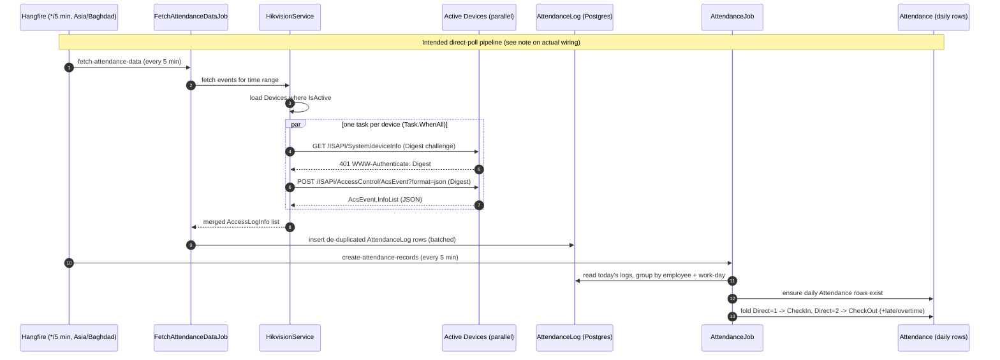
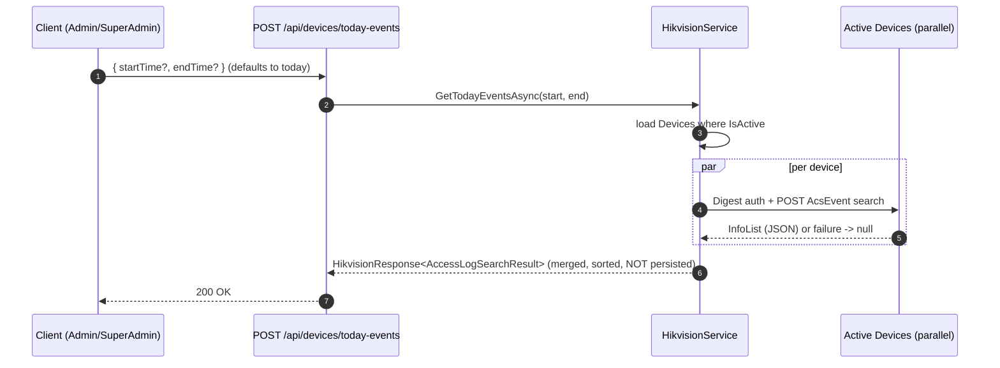

# Hikvision Device Integration

> Source of truth: `original/AttendanceAppV2/src`. This document was written against the real
> code; where the implementation diverges from the original integration brief, the divergence is
> called out explicitly (see [Discrepancies](#discrepancies-vs-the-brief)).

## Purpose

Talk directly to Hikvision access-control terminals (face / card / fingerprint readers such as the
`DS-K1T673DWX`) over their **ISAPI** HTTP(S) interface, pull **access-control events**
(check-ins / check-outs), and surface them as attendance data.

The integration lives in `HikvisionService`
(`src/Infrastructure/Services/HikvisionService.cs`) behind the interface
`IHikvisionService` (`src/Application/Abstractions/Data/IHikvisionService.cs`):

```csharp
public interface IHikvisionService : IDisposable
{
    Task<HikvisionResponse<DeviceStatus>>        TestConnectionAsync(Guid deviceId);
    Task<HikvisionResponse<AccessLogSearchResult>> GetTodayEventsAsync(DateTime startTime, DateTime endTime);
    Task<HikvisionResponse<List<DeviceStatus>>>  TestAllDevicesConnectionAsync();
}
```

## Protocol & transport

- **HTTP or HTTPS** — the scheme is taken verbatim from each `Device.Protocol` column, so a device
  row drives whether the call is `http://` or `https://`.
- ISAPI endpoints used:
  - Events: `POST {protocol}://{ip}:{port}/ISAPI/AccessControl/AcsEvent?format=json`
  - Device info / liveness: `GET {protocol}://{ip}:{port}/ISAPI/System/deviceInfo` (returns XML)
- The `HttpClient` is registered via `AddHttpClient<IHikvisionService, HikvisionService>` in
  `src/Infrastructure/DependencyInjection.cs` with a **30 s timeout** and
  `User-Agent: AttendanceApp/1.0`.

## Authentication — HTTP **Digest** (not Basic)

Despite the integration brief saying "basic auth", the code implements **HTTP Digest
Authentication (MD5)** by hand (`SetDigestAuthenticationAsync` / `CreateDigestAuthHeader`):

1. Send an unauthenticated `GET` to the same URI to provoke a `401` with a
   `WWW-Authenticate: Digest ...` challenge.
2. Parse the challenge (`realm`, `nonce`).
3. Compute the response:
   - `HA1 = MD5(username:realm:password)`
   - `HA2 = MD5(method:uri)`
   - `response = MD5(HA1:nonce:HA2)`
   - (no `qop`/`nc`/`cnonce` — a minimal Digest implementation)
4. Attach `Authorization: Digest username="…", realm="…", nonce="…", uri="…", response="…"`
   to the real request.

`username` / `password` come from the `Device` row. MD5 is used in lowercase hex because the
devices require it (the code suppresses the `CA5351` "broken crypto" analyzer warning accordingly).

## Device entity configuration

Connectivity is fully data-driven from `public."Devices"` (entity
`src/Domain/Entities/Devices/Device.cs`). The columns that matter for the integration:

| Field | Role |
|---|---|
| `IpAddress` | host of the terminal |
| `Port` | TCP port (string) |
| `Protocol` | `http` / `https` — chooses the URL scheme |
| `Username` / `Password` | Digest credentials |
| `IsActive` | only `IsActive == true` devices are polled / tested |
| `DeviceId`, `SerialNumber` | identification / logging |
| `IsupKey` | ISUP/Hik-Connect push key — **stored but not used** by `HikvisionService` (the service is pull-only over ISAPI; see notes) |
| `Location`, `DeviceModel`, `MacAddress`, `FirmwareVersion`, `OrganizationId` | metadata, echoed back in `DeviceStatus` |

Device CRUD and the column semantics are documented in [../backend/devices.md](../backend/devices.md).

## Event fetching by time range + parallel multi-device query

`GetTodayEventsAsync(startTime, endTime)`:

1. Loads **all active devices** (`Devices.Where(d => d.IsActive)`).
2. Fires one `GetDeviceEventsAsync(device, start, end)` task **per device** and awaits them all in
   parallel with `Task.WhenAll` — a slow/offline device does not block the others (each call is
   wrapped in try/catch and returns `null` on failure).
3. For each device it `POST`s an `AcsEventCond` search body:
   ```jsonc
   {
     "AcsEventCond": {
       "searchID": "<guid>",
       "searchResultPosition": 0,
       "maxResults": 8000,
       "major": 5,            // access-control event
       "minor": 75,           // specific sub-event filter
       "startTime": "yyyy-MM-ddTHH:mm:ssZ",
       "endTime":   "yyyy-MM-ddTHH:mm:ssZ"
     }
   }
   ```
4. Deserializes the JSON into `AccessLogSearchResult` (`AcsEvent.InfoList` → `List<AccessLogInfo>`;
   see `src/Application/Models/HikvisionModels.cs`), **case-insensitive**.
5. Merges every device's `InfoList`, sorts by `time` descending, and returns a single
   `HikvisionResponse<AccessLogSearchResult>` whose `Message` reports
   `تم جلب N حدث من X/Y جهاز` (fetched N events from X/Y devices).

`TestConnectionAsync` / `TestAllDevicesConnectionAsync` use the same Digest flow against
`/ISAPI/System/deviceInfo`, parsing the returned **XML** into a `DeviceInfo` (model, serial,
firmware, etc.) for a `DeviceStatus` report.

## How it is reached at runtime — on-demand only

`HikvisionService` is wired to HTTP endpoints, not to the recurring jobs:

| Endpoint | File | What it calls |
|---|---|---|
| `POST /api/devices/today-events` | `src/Web.Api/Endpoints/Devices/GetTodayEvents.cs` | `GetTodayEventsAsync` |
| `POST` test-single | `src/Web.Api/Endpoints/Devices/TestSingleConnection.cs` | `TestConnectionAsync` |
| `POST` test-all | `src/Web.Api/Endpoints/Devices/TestAllConnections.cs` | `TestAllDevicesConnectionAsync` |

`GetTodayEvents` defaults `startTime`/`endTime` to **today** (`DateTime.Today` →
`Today + 1 day − 1 s`) when the request omits them, requires an `Admin`/`SuperAdmin` JWT role, and
is rate-limited (`per-user`). It returns the live device events **without persisting them** — it is
a read/preview path.

## The recurring pipeline (Hangfire, every 5 min, Asia/Baghdad)

`HangfireJobScheduler.ScheduleRecurringJobs()`
(`src/Infrastructure/BackgroundJobs/HangfireJobScheduler.cs`, invoked from `Program.cs` at startup)
registers **two** recurring jobs, both on cron `*/5 * * * *` in the **`Asia/Baghdad`** time zone:

| Job id | Cron | Implementation | Effect |
|---|---|---|---|
| `fetch-attendance-data` | `*/5 * * * *` | `FetchAttendanceDataJob` → `IAttendanceDataSyncService.FetchAndProcessNewEventsAsync()` | ingests raw events into `AttendanceLog` |
| `create-attendance-records` | `*/5 * * * *` | `AttendanceJob` → `IAttendanceProcessingService` | folds logs into daily `Attendance` |

> **Important:** the recurring `fetch-attendance-data` job does **not** call `HikvisionService`.
> Its `syncService` is `AttendanceDataSyncService`, which reads the **legacy MSSQL `EventTab`**
> (see [mssql-sync.md](./mssql-sync.md)). In the current code the direct Hikvision ISAPI poll is an
> **on-demand** path only. The diagram below shows the brief's intended pipeline annotated with how
> the code actually wires it.

`AttendanceJob.CreateAttendanceRecordsAsync()`
(`src/Infrastructure/BackgroundJobs/AttendanceJob.cs`) runs two processing-service steps:

1. `CreateAttendanceRecordsAsyncIfNotExists()` — ensure a daily `Attendance` row exists per
   employee.
2. `UpdateAttendancesCheckInAndCheckOutAsync()` — group `AttendanceLog` rows by
   employee + work-day and fold them:
   - `Direct == 1` logs → earliest is **CheckIn** (`CheckInMethod = Biometric`)
   - `Direct == 2` logs → latest is **CheckOut** (`CheckOutMethod = Biometric`)
   - derives worked/late/overtime; if only one side exists it estimates the other with an 8-hour
     window (`src/Infrastructure/Services/AttendanceProcessingService.cs`).

### Sequence: the (intended) device → attendance pipeline



### Sequence: on-demand events (what the code actually exposes for Hikvision)



## Discrepancies vs. the brief

1. **Auth is Digest (MD5), not Basic.** The `Device.Username`/`Password` are used to compute a
   Digest challenge response, not a `Basic` header.
2. **The 5-minute `fetch-attendance-data` job does not call `HikvisionService`.** It calls
   `AttendanceDataSyncService` against the legacy MSSQL `EventTab`. The direct ISAPI poll is reached
   only via the `today-events` / test endpoints. So the "Hangfire → FetchAttendanceDataJob →
   HikvisionService → AttendanceLog" chain is the *intended* design but is **not** how the current
   code is wired; the brief's diagram is preserved above with that caveat.
3. **`IsupKey` is stored but unused** by `HikvisionService` (the service is pull/ISAPI only; ISUP
   would be a push channel).
4. The event search filters on `major=5, minor=75` and caps at `maxResults=8000` per device per
   call (no pagination loop).

## Related

- [../backend/devices.md](../backend/devices.md) — Device entity & CRUD.
- [mssql-sync.md](./mssql-sync.md) — the legacy event source that the recurring job actually uses.
