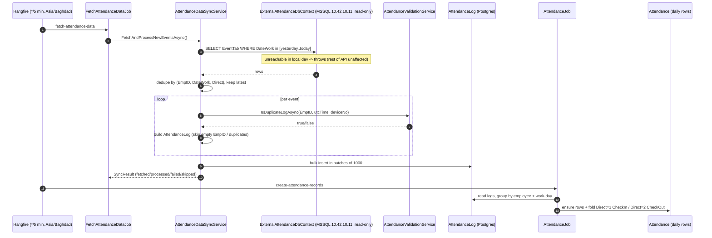

# Legacy MSSQL Attendance Sync (`EventTab`)

> Source of truth: `original/AttendanceAppV2/src`. Written against the real code.

## What it is

A pull-based sync from a **legacy SQL Server** attendance system into the application's own Postgres
`AttendanceLog` table. This is the **active event source** behind the recurring 5-minute Hangfire
job — and it runs **alongside** the direct Hikvision ISAPI poll path
(see [hikvision-devices.md](./hikvision-devices.md)), which in the current code is only an on-demand
endpoint. In practice: **MSSQL `EventTab` is the path that actually feeds scheduled ingestion;
Hikvision direct-poll is the alternative/on-demand path.**

## The external database

Registered in `src/Infrastructure/DependencyInjection.cs`:

```csharp
string? sqlServerConnectionString = configuration.GetConnectionString("sqlServer");
// SQL Server - External Database (Read-Only for EventTab)
services.AddDbContext<ExternalAttendanceDbContext>(options =>
    options.UseSqlServer(sqlServerConnectionString));
```

Connection string (`appsettings.json` / `appsettings.Development.json`):

```
Server=10.42.10.11;Database=AttendDB;User Id=sisilog;Password=…;TrustServerCertificate=True;
```

### Local-dev caveat (from the repo `CLAUDE.md`)

The remote MSSQL host `10.42.10.11` is **unreachable in local dev**. Per the root `CLAUDE.md`:

> `appsettings.json` has a `sqlServer` connection to a remote MSSQL (`10.42.10.11`) that is
> unreachable locally. The API starts fine; only a specific sync/integration feature would need it.

So: the API boots normally because the `ExternalAttendanceDbContext` is registered but not opened at
startup; the connection is only attempted when the sync runs. With no route to `10.42.10.11`, the
recurring `fetch-attendance-data` job will fail/throw at `FetchEventsFromExternalDatabaseAsync` (it
re-throws as `InvalidOperationException`), but the rest of the app — including the Hikvision
on-demand endpoints — is unaffected.

## The `ExternalAttendanceDbContext`

`src/Infrastructure/Database/ExternalAttendanceDbContext.cs` is a minimal, **read-only** EF Core
context exposing a single table:

```csharp
public DbSet<EventTab> EventTabs { get; set; }

modelBuilder.Entity<EventTab>(entity =>
{
    entity.ToTable("EventTab", schema: "dbo");
    entity.HasNoKey();   // read-only view-style table, no primary key
});

public void ConfigureForReadOnly()  // NoTracking + AutoDetectChanges off
```

- Table: `dbo.EventTab`. Keyless (`HasNoKey`) — treated as a read-only result set.
- A `ConfigureForReadOnly()` helper exists to switch the context to `NoTracking`.

### `EventTab` shape

`src/Domain/Models/EventTab.cs`:

| Field | Type | Meaning |
|---|---|---|
| `DateTimeAttend` | `DateTime` | full event timestamp |
| `CardNo` | `string` | badge / card number |
| `EmpID` | `string` | employee identifier (key for mapping) |
| `DateWork` | `DateOnly` | work-day the event belongs to |
| `TimeAttend` | `TimeSpan?` | time-of-day component |
| `Direct` | `int` | direction: `1` = in / `2` = out |
| `DeviceName` | `string` | source terminal name |
| `DeviceNo` | `string` | source terminal id |
| `EmpName` | `string` | employee name (not persisted to `AttendanceLog`) |

## The sync service

`src/Infrastructure/Services/AttendanceDataSyncService.cs` (interface
`src/Infrastructure/Services/Interfaces/IAttendanceDataSyncService.cs`). The active entry point is
`FetchAndProcessNewEventsAsync()`, **and it is reached** — `FetchAttendanceDataJob`
(`src/Infrastructure/BackgroundJobs/FetchAttendanceDataJob.cs`) injects
`IAttendanceDataSyncService` and calls it; that job is scheduled every 5 minutes by
`HangfireJobScheduler.ScheduleRecurringJobs()`.

### `FetchAndProcessNewEventsAsync()` flow

1. **Date window.** Despite comments mentioning "last 7 days", the actual range is **yesterday →
   end of today** (`todayStart.AddDays(-1)` → `todayEnd`), converted to `DateOnly`.
2. **Read external events** via `FetchEventsFromExternalDatabaseAsync(from, to)`:
   `EventTabs.Where(e => e.DateWork >= from && e.DateWork <= to)`, then **de-duplicated in memory**
   to one record per `(EmpID, DateWork, Direct)` group, keeping the most recent `DateTimeAttend`.
   String fields are trimmed.
3. **Map → `AttendanceLog`** for each event:
   - skip rows with empty `EmpID` (counted as skipped + warning);
   - `dateTimeProvider.EnsureUtc(DateTimeAttend)` to normalize the timestamp to UTC;
   - call `IAttendanceValidationService.IsDuplicateLogAsync(EmpID, dateTimeAttendUtc, deviceNo)` and
     skip duplicates already present in Postgres;
   - build an `AttendanceLog` (new `Guid` id, `CardNo`, `EmpID`, `DateWork`, `TimeAttend`,
     `Direct`, `DeviceName`, `DeviceNo`, `CreatedAt`/`LastUpdatedAt`).
4. **Bulk insert** valid logs into `ApplicationDbContext.AttendanceLogs` in **batches of 1000**,
   with `AutoDetectChangesEnabled = false` and detaching each batch after save (memory hygiene).
5. Returns a `SyncResult` (fetched / processed / failed / skipped + duration + errors/warnings).
   Fatal errors are logged and re-thrown as `InvalidOperationException`.

Other interface methods:
- `GetLastSuccessfulSyncTimeAsync()` — newest non-deleted `AttendanceLog.CreatedAt`.
- `TestConnectionAsync()` — `externalContext.Database.CanConnectAsync()` + a `Take(1)` probe.

### From `AttendanceLog` to daily `Attendance`

The sync only fills `AttendanceLog`. The second recurring job, `create-attendance-records`
(`AttendanceJob` → `IAttendanceProcessingService`), folds those logs into daily `Attendance` rows
(`Direct=1` → CheckIn, `Direct=2` → CheckOut). That step is shared with — and documented in —
[hikvision-devices.md](./hikvision-devices.md).

## Sequence: MSSQL sync flow



## Notes / findings

- The active sync entry point **was found** and is wired: `FetchAttendanceDataJob`
  (`IAttendanceDataSyncService`) on the `fetch-attendance-data` Hangfire recurring job.
- This is the **legacy / alternative event source** that runs alongside the Hikvision direct-poll
  path. In the current wiring it is the one that feeds scheduled ingestion.
- The brief's "last 7 days" description does not match the code, which uses a
  **yesterday → today** window (`AddDays(-1)`).
- The external table is keyless and read-only; deduplication happens **client-side** in EF
  (`GroupBy` after materializing the query).
- Credentials for `10.42.10.11` are committed in `appsettings*.json` — flagged here as a
  finding, not changed.

## Related

- [hikvision-devices.md](./hikvision-devices.md) — the direct device-poll (ISAPI) path and the
  shared log→attendance fold step.
- [../backend/devices.md](../backend/devices.md) — Device entity & CRUD.
